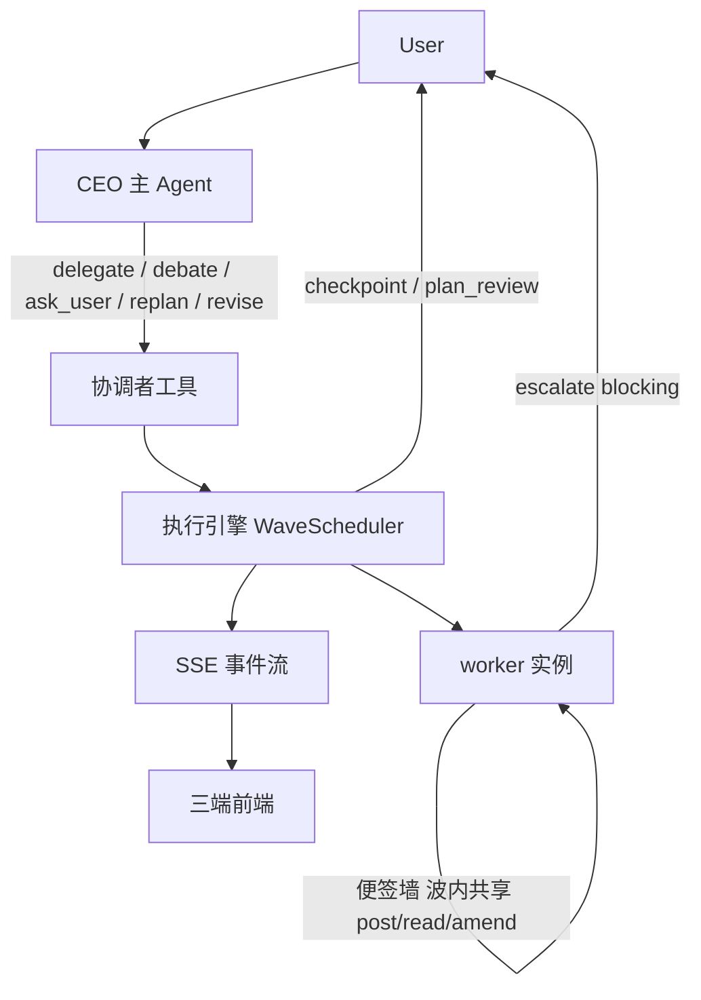

# AI 运行时总览

> **03-AI 核心入口**：先用「端到端速览」给多 Agent 运行时的全景（新 AI 冷启动一屏看懂主干），再做路由（改 X 读哪篇、哪篇是权威）。速览只串主干、**不重复各专题正文**，细节随每条 → 链接进权威文档。

## 概念关系

## 端到端速览

> 新 AI 冷启动先读这节拿全景；要改某处再顺下方「权威归属表 / 读序」进专题文档。本节只串主干，**不重复正文**——每条 → 指向唯一权威。

**一句话**：单一 **CEO 主 Agent** 对话 + 按需 `delegate` 组团 → **DAG 波次调度** → CEO 在**波边界监督** → 共享工作区**中转产物** → **三模型**（Interaction / Journal / Run）兜底运行时。

**主干串联**（一个回合从入口到收尾）：

1. **入口 · 对话**：用户只对 CEO 说话。CEO 默认走快的 `chat` 档，轻量 / 单点的只读请求直接流式作答（零编排开销，体验同 ChatGPT）。→ [编排器 §聊天优先](/docs/03-AI核心/编排器与CEO主Agent.md)
2. **组团 · delegate**：活有规模 / 有结构时（实质交付物，或成规模广度调查），CEO 在 ReAct 循环里调 `delegate` 下达一批子任务；`depends_on` 边定形 DAG（无依赖即并行），是「串行 / 并行 / 混合」的唯一开关。→ [编排器 §一·delegate](/docs/03-AI核心/编排器与CEO主Agent.md)
3. **调度 · WaveScheduler**：`build_run_plan` 一次建全 DAG，`WaveScheduler` 逐波并发跑（`max_parallel=8`，worker = asyncio 协程），只在决策边界（CHECKPOINT / BIND / SCOPE）把控制权交回 CEO。→ [执行引擎 §一·受监督的波循环](/docs/03-AI核心/执行引擎架构设计.md)
4. **协作 · 产物中转 + 便签墙**：Agent 间**不直连**——上游产物经调度器注入下游（`pass_through` 共享预算水填充 + 首尾保留 / 落盘者递指针）；另有被动通道（扇出兄弟感知 / 拓扑位置 / `escalate`），以及波内**主动共享的便签墙**（边干边对齐、可改写 / 作废、并入收尾对账）——把并行竖井变协作的关键一环。→ [协作模式 §二](/docs/03-AI核心/Agent协作模式.md)
5. **监督 · replan 续跑**：计划含晚绑定（`bind_after_deps`）或队员报 `escalate kind=scope` 时，调度器在波边界让出，CEO 调 `replan`（binds / steers / add / stop）续跑**同一张 DAG**。→ [编排器 §一·replan](/docs/03-AI核心/编排器与CEO主Agent.md)
6. **升级 · 向用户**：worker 撞上死结用 `escalate`（`blocking=false` 问而不停 / `blocking=true` 挂起求决策）经 CEO 中转到用户；CEO 自己在关键岔路 / 开工提案用 `ask_user`。→ [协作模式 §二·escalate](/docs/03-AI核心/Agent协作模式.md) · [编排器 §四](/docs/03-AI核心/编排器与CEO主Agent.md)
7. **收尾 · 一个声音**：worker 跑完，CEO 用**自己的声音**写一段简短综述（不复述全文，各 worker 产出由前端单独展示）；单 worker + `finalize` 时产出直出、省合成轮。→ [编排器 §一·终态语义](/docs/03-AI核心/编排器与CEO主Agent.md)
8. **韧性 · 三模型兜底**：Interaction（唯一挂起）/ Turn Journal（唯一事实源、可回放）/ Run（唯一执行单元）；收敛靠 `LoopController` + 交付前 `finish_guard`；执行与请求解耦——断连 ≠ 取消。→ [执行引擎 §八·三模型](/docs/03-AI核心/执行引擎架构设计.md) · [§四·收敛](/docs/03-AI核心/执行引擎架构设计.md)

**角色与编排原语**（速查，详见权威）：

| 维度 | 形态 | 一句话 | 权威 |
|---|---|---|---|
| 角色 · CEO | 唯一对话入口与声音 | 只持只读 / 检索工具，用于侦察 + 收尾；规模活一律委派 | [编排器 §核心定位](/docs/03-AI核心/编排器与CEO主Agent.md) |
| 角色 · worker | 默认可再委派一层、隔离上下文 | 持全套工具动手；depth<2 默认获 `delegate`+`replan`；不能反问（改用 `escalate`）；一次性但可恢复 | [协作模式 §一](/docs/03-AI核心/Agent协作模式.md) |
| 原语 · `delegate` | CEO 下达子任务 | `depends_on` 定 DAG、`model_preference`、`result_handling`、`can_delegate`(≤2 层，lead 配 `replan`)、`playbook` 固化形状 | [编排器 §一–二](/docs/03-AI核心/编排器与CEO主Agent.md) |
| 原语 · `replan` | 波边界续跑同一 DAG | binds / steers / add / stop | [编排器 §一·replan](/docs/03-AI核心/编排器与CEO主Agent.md) |
| 原语 · `revise` | worker transcript 上热修 | 留人续写，双 miss 回落重派 | [多轮编排与队员热修](/docs/03-AI核心/多轮编排与队员热修.md) |
| 原语 · `debate` | 主持人驱动逐轮交锋 | 工具内确定性循环，产决策简报 + 交锋叙事双产物 | [辩论编排设计](/docs/03-AI核心/辩论编排设计.md) |
| 原语 · `ask_user` | CEO 唯一发问 | 开工提案卡 + 途中拍板；`blocking` 正交维度 | [编排器 §四](/docs/03-AI核心/编排器与CEO主Agent.md) |
| 原语 · `escalate` | worker 唯一向上通道 | 阻塞 / 非阻塞；`kind=scope` 纠偏 / `kind=dep` 缺输入，均喂波边界 | [协作模式 §二](/docs/03-AI核心/Agent协作模式.md) |
| 协作 · 便签墙 | 波内结构化共享面 | `post_note`(定了/提醒/领了) + `read_notes` 拉 + `amend_note` 改写作废；推增量、并入收尾对账 | [协作模式 §二·波内共享上下文](/docs/03-AI核心/Agent协作模式.md) |

## 权威归属表

| 主题 | 权威文档 | 备注 |
|---|---|---|
| DAG 调度、波次、晚绑定、边界让出 | [执行引擎 §一·受监督的波循环](/docs/03-AI核心/执行引擎架构设计.md) | `replan` 工具形态 → [编排器 §一](/docs/03-AI核心/编排器与CEO主Agent.md) |
| `delegate` 字段语义、`depends_on`、产物保真 | [编排器 §二](/docs/03-AI核心/编排器与CEO主Agent.md) | 执行流程 → [执行引擎 §三](/docs/03-AI核心/执行引擎架构设计.md) |
| `ask_user` / `plan_review` 检查点 | [编排器 §四–五](/docs/03-AI核心/编排器与CEO主Agent.md) | 挂起机制 → [执行引擎 §八·Interaction](/docs/03-AI核心/执行引擎架构设计.md) |
| `revise` / `RunSession` 续写 | [多轮编排与队员热修](/docs/03-AI核心/多轮编排与队员热修.md) | Run 模型 → [执行引擎 §八·Run](/docs/03-AI核心/执行引擎架构设计.md) |
| 辩论 / 审查 | [辩论编排设计](/docs/03-AI核心/辩论编排设计.md) | 无独立执行分支 |
| Agent 间通信、便签墙、`escalate` | [Agent 协作模式 §二](/docs/03-AI核心/Agent协作模式.md) | 禁止 worker↔worker 直连；便签墙 = 波内结构化共享（非直聊）|
| 协作质量度量（MAST）| [管理员后台 §四](/docs/05-平台与运维/管理员后台.md) | 在线 `turn_metrics` 四列 + 离线 `log_stats` + MAST 评测集 |
| 上下文 8 通道、`run_context` | [上下文传递可视化](/docs/03-AI核心/上下文传递可视化.md) | 记忆注入 → [记忆系统](/docs/03-AI核心/Agent记忆与知识系统.md) |
| 系统提示词装配 / 工作区概览 / 缓存 / 长对话压缩 | [记忆系统 §5.5–5.6](/docs/03-AI核心/Agent记忆与知识系统.md) | 装配 `runtime/context`（`PromptContributor` 插件 + `SectionOrder` 声明序，稳定前缀护缓存）；压缩 → [执行引擎 §三](/docs/03-AI核心/执行引擎架构设计.md)；是否统一 + 扳机（向量 RAG / consult_rule / 预算 Assembler 均已缓）→ [上下文工程](/docs/03-AI核心/上下文工程.md)；工具输出 head+tail 截断 → 见代码 `core/text.truncate_head_tail` |
| ReAct、收敛、`finish_guard` | [执行引擎 §四](/docs/03-AI核心/执行引擎架构设计.md) | — |
| SSE 事件契约 | [执行引擎 §二](/docs/03-AI核心/执行引擎架构设计.md) | → 见代码 `runtime/events/` |
| Turn / Journal / Interaction 三模型 | [执行引擎 §八](/docs/03-AI核心/执行引擎架构设计.md) | — |
| 工具装配、审批门 | [执行引擎 §五](/docs/03-AI核心/执行引擎架构设计.md) | Skill 域 → [工具与能力系统](/docs/03-AI核心/工具与能力系统.md) |
| AI 小镇模拟（MVP） | 本节「AI 小镇模拟」 | 与 CEO 编排运行时独立；桌面 3D 观察层 |

## AI 小镇模拟

**定位**：多居民 LLM 驱动的可观测社会模拟（与产品对话编排并行），M1–M4 MVP 已落地。

| 层 | 路径 | 职责 |
|---|---|---|
| 后端引擎 | `apps/server/agentcore/simulation/` | `world/` 时钟与持久化；`agents/` tick 推理；`interaction/` 对话/交易/投票；`events/` 五类世界事件；`observe/` 宏观指标；`experiment/manifest` 可复现配置 |
| REST + SSE | `agentcore/api/routes/simulation/` | 创建 run、推进 tick、回放帧、`/metrics` 时序、`/manifest` 导出 |
| 数据表 | `simulation_run` / `sim_tick` / `sim_agent` / `sim_event` | tick 快照与事件审计 |
| 桌面前端 | `apps/desktop/src/renderer/`（simulation 路由） | 3D 小镇、交互可视化、跟踪/上帝/观察模式、时间轴回放 |
| 验收 | `apps/server/tests/simulation/test_mvp_acceptance.py` | 10 居民 × 20 tick × 3 次 mock 运行 + 方差报告（无硬阈值门） |

**运行**：后端设 `SIMULATION_ENABLED=true` 并配置模拟 LLM；桌面 `pnpm dev` 进入小镇视图。端到端烟测：`pnpm -C apps/desktop sim:smoke:e2e`（需已启动后端 + `seed_dev_user`；`SMOKE_MOCK=1` 仅验连通）。

## 四条读序

**改编排（CEO 行为）**  
编排器 → 执行引擎 §一（检查点/晚绑定）→ 协作模式 §二

**改执行引擎（调度/ReAct/SSE）**  
执行引擎 → 核心接口定义 §SSE → 前端 SSE 消费（[前端技术与架构 §十二](/docs/04-前端/前端技术与架构.md)）

**改协作范式（辩论/升级/冲突）**  
协作模式 → 辩论编排（若涉辩论）→ 上下文传递可视化（若涉前端呈现）

**改上下文装配（系统提示词/预算/缓存/压缩）**  
记忆系统 §5（上下文模型）→ 执行引擎 §三（长对话压缩）→ 上下文工程（是否统一 + 两个扳机）

## 被否决（勿重开）

| 方案 | 理由 | 详见 |
|---|---|---|
| 独立 Arena 子系统 | 主持人复用 DAG，非独立引擎 | [辩论编排 §八](/docs/03-AI核心/辩论编排设计.md) |
| worker→CEO 波内重入解阻塞升级 | 波内无活着的 CEO | [协作模式 §二](/docs/03-AI核心/Agent协作模式.md) |
| Agent 直接通信 | 成本、不可观测 | [协作模式 §二](/docs/03-AI核心/Agent协作模式.md) |
| 树级共享 Semaphore | 父子互等死锁 | [协作模式 §7.6](/docs/03-AI核心/Agent协作模式.md) |
