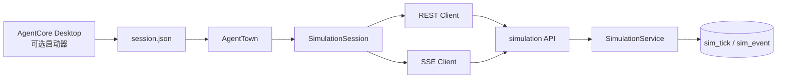

# AgentTown 客户端

> **定位**：AgentCore 的独立 Unity 3D 模拟观测客户端。本文记录当前架构、产品边界和长期不变量；打开工程、构建、资产与测试命令见 `apps/town/README.md`。

## 1. 产品边界

| 维度 | 当前定案 |
|---|---|
| 产品名 | AgentTown |
| 引擎 | Unity 6 LTS + URP + C# |
| 角色 | AI 小镇的观看、控制与回放客户端 |
| 后端 | 与 AgentCore Desktop 共用账号和 `simulation/` 服务 |
| 主入口 | Windows 独立应用；WebGL 构建作为传播入口演进 |
| Desktop | 仅写会话文件并启动 AgentTown，不内嵌 3D 世界 |
| 核心体验 | 观察小镇、跟踪居民、推进 tick、回放、注入预设事件；⏳ 节目模式（AI 恋综唯一观看壳，2026-07-13 定案 → [AI 恋综场景提案](/docs/06-规划/AI恋综场景提案.md) §3.9） |

AgentTown 不包含 LLM、不在本地推算世界状态，也不重写 Python WorldEngine。后端模拟现状见 [运行时总览](/docs/03-AI核心/运行时总览.md#ai-小镇模拟)。

## 2. 架构与数据流

| 层 | 职责 |
|---|---|
| `SimulationSession` | 当前 run、模式、playhead、居民、事件与连接状态的唯一客户端真相 |
| REST 客户端 | 创建/恢复 run、推进 tick、读取快照、manifest、metrics 与事件注入 |
| SSE 客户端 | 接收 Live 增量事件，不作为历史快照的第二权威源 |
| 3D 世界 | 把权威快照投影为场景、NPC、交互叠加与热力表现 |
| HUD | 顶栏状态、底栏播放、左侧运行/上帝模式、右侧居民/决策/事件 |
| Desktop 启动器 | 写认证会话并 spawn AgentTown |

## 3. 核心不变量

1. **后端快照是世界真相**：位置、居民状态和世界状态以 `sim_tick` 快照为准。
2. **客户端只消费契约**：Unity 不运行 LLM，也不自行推进模拟规则。
3. **单一状态机**：UI、3D 与网络层共享 `SimulationSession`，不得再建并行 store。
4. **Live 与 Replay 共用快照入口**：两种模式最终都通过同一 `ApplySnapshot` 路径更新世界。
5. **Live 不走双写路径**：收到 `sim.tick_ended` 后读取对应 tick；忽略 `sim.tick_frame` 对世界状态的更新，避免与 REST 快照竞争。
6. **Replay 逐帧读取**：历史回放以 `GET /ticks/{n}` 为唯一帧来源，不再并行维护 replay SSE。
7. **坐标只转换一次**：wire 坐标到 Unity 坐标的映射集中在坐标转换/快照应用边界；区域坐标以 protocol-conformance fixture 为准。
8. **视觉偏移不回写**：同区域 NPC 的防重叠偏移只影响渲染，不改变后端位置。

## 4. SimulationSession

### 4.1 状态边界

`SimulationSession` 集中持有当前 run、状态、模式、playhead、播放速度、居民、事件、manifest、tick 缓存和 SSE 连接态。HUD、3D 世界和网络回调只能通过该状态机读写会话状态。

### 4.2 Live、Replay 与 Offline

| 模式 | 事件处理 | 位置更新 |
|---|---|---|
| Live | 消费 tick、居民、交互和世界事件 | `tick_ended` 后读取对应快照并应用 |
| Replay | 忽略会改变世界状态的 Live 增量 | 只读取 playhead 对应快照 |
| Offline Demo | 无网络事件 | 本地故事包生成帧，仍走 `ApplySnapshot` |
| 自动播放 | 沿历史 playhead 定时前进 | 到达尾部后回到 Live；Offline 停在末帧 |

这套分层保证 Offline/scripted 可以验证观看层，但它们不能替代真 LLM 涌现验证。

### 4.3 ApplySnapshot

所有世界帧统一经过 `ApplySnapshot`：

1. 把 wire 坐标映射为 Unity 坐标；
2. 合并 manifest、local persona 与运行时居民状态；
3. Replay 直接定位，Live 使用 NavMesh 走向目标；
4. 应用只影响画面的 spawn offset；
5. 更新 3D、HUD 与 tick 缓存。

## 5. REST API

基址为 `/v1/simulation`。路径以服务端 OpenAPI 为准，客户端只维护消费映射。

| 动作 | 路径 |
|---|---|
| 创建 run | `POST /runs` |
| 推进 tick | `POST /runs/{id}/tick` |
| 读取历史帧 | `GET /runs/{id}/ticks/{n}` |
| Live SSE | `GET /runs/{id}/stream` |
| 读取 manifest | `GET /runs/{id}/manifest` |
| 暂停/继续 | `POST /runs/{id}/pause`、`POST /runs/{id}/resume` |
| 指标 | `GET /runs/{id}/metrics` |
| 注入事件/修改居民 | `POST /runs/{id}/inject`、`PATCH /runs/{id}/agents/{agent_id}` |

## 6. 数据契约

### 6.1 Tick 快照

`SimTickSnapshot` 是一帧世界状态的权威载体。C# DTO 容忍服务端新增可选字段，但不得自行推导会改变世界语义的缺失字段。

### 6.2 坐标

Wire 使用 Y-up 右手系，Unity 使用 Y-up 左手系。转换只翻转 `z` 轴，世界比例为 1：

`unity = (wire.x, wire.y, -wire.z)`

区域坐标以 `packages/protocol-conformance/fixtures/simulation-region-positions.json` 为准；当前市场 oracle 为 wire `(36, 0, 0)` → Unity `(36, 0, 0)`。

### 6.3 区域

区域 fixture 是 10 个 gameplay 区域的单一真相源，并同步到 Unity `StreamingAssets/Fixtures/`。场景布局可以围绕锚点增加视觉元素，但不能另建一套 gameplay 坐标。

### 6.4 居民资料

| 数据 | 权威源 |
|---|---|
| ID、姓名、职业、性格、区域 | run manifest |
| 运行时位置、活动、情绪、关系 | tick snapshot |
| manifest 尚未携带的展示文案 | 本地 `town-personas.json` 临时补齐 |

### 6.5 视觉偏移

同区域居民的 spawn offset 只用于避免模型重叠。偏移在 Unity 侧应用，禁止回写到后端世界状态。

### 6.6 SSE

| 事件 | Live 行为 | Replay 行为 |
|---|---|---|
| `sim.tick_started` | 标记推进中 | 忽略 |
| `sim.tick_ended` | 读取并应用对应快照 | 忽略 |
| `sim.agent_action` / `sim.agent_state` | 更新观测信息 | 忽略 |
| `sim.interaction` / `sim.world_event` | 进入事件流和 3D 叠加 | 忽略 |
| `sim.tick_frame` | 忽略，避免双路径 | 不作为首选帧源 |

### 6.7 兼容原则

Unity DTO 对未知字段和缺失的可选字段保持向前兼容；事件名、必填字段或坐标语义发生变化时，必须同步契约、fixture 与 EditMode conformance，不以静默兜底掩盖漂移。

## 7. 观测体验

| 区域 | 内容 |
|---|---|
| 顶栏 | run 状态、世界时钟、tick、SSE、FPS、宏观指标、世界修饰符、鸟瞰 |
| 底栏 | 推进/暂停、Live/Replay、时间轴、倍速 |
| 左侧轨 | Offline Demo、新建/恢复 run、预设事件注入 |
| 右侧轨 | 居民、决策、事件 |
| 中央 | 3D 小镇、NPC、区域、交互叠加 |

观看层采用两级镜头：默认鸟瞰用于理解全局，选择居民后可进入跟踪模式。世界内气泡和名牌使用适合 3D 的 world-space UI；数据密集的观测 chrome 使用 UI Toolkit。

## 8. 认证、启动与分发

### 桌面构建

- AgentTown 可通过 CLI 参数接收 API、token 和可选 run ID；
- 无 CLI 参数时，可读取 Desktop 写入的 `%APPDATA%/AgentCore/session.json`；
- Desktop `#/simulation/town` 只是启动器，不承担观测 UI；
- 未找到 AgentTown 可执行文件时，Desktop 必须明确提示安装或配置路径。

### WebGL

- WebGL 不读取本机 `session.json`；
- 开发阶段通过 URL/宿主页传递 API、token 和 run；
- 正式传播版的同源会话、公开访问和 token 暴露边界尚未定稿。

## 9. Run 生命周期与本地历史

- 客户端保存最近 run，支持通过 run ID 恢复；
- 本地历史只是入口缓存，不是模拟状态真相；
- Desktop 与 AgentTown 可以共享启动目标，但不得各自维护世界快照；
- 用户维度的服务端 run 列表属于产品化能力，不应靠扩大本地缓存替代。

## 10. 单一真相源

| 内容 | 权威源 |
|---|---|
| 后端模拟行为 | `apps/server/agentcore/simulation/` |
| REST 接口 | `apps/server/agentcore/api/routes/simulation/` + OpenAPI |
| SSE 事件名 | `packages/contract-types` |
| 区域坐标与协议样本 | `packages/protocol-conformance/fixtures/` |
| Offline/scripted 故事内容 | `packages/town-story-packs/` |
| 3D 资产 | `apps/town/Assets/TownAssets/` |
| Unity 运行与构建 | `apps/town/README.md` |
| Editor 接线 | `apps/town/EDITOR-WIRING.md` |

## 11. 当前状态与已确认目标

### ✅ 已落地

- Unity 6 LTS + URP 独立客户端；
- 10 区域小镇、多 NPC、鸟瞰与跟踪；
- REST/SSE、Live/Replay、manifest、metrics；
- Offline Demo 与 scripted 演示；
- 顶栏/底栏/左右轨观测 HUD；
- 对话、交易、投票和世界事件的观测表现；
- Windows 与 WebGL 构建链路；
- Desktop 会话文件与启动器；
- UE 和 Desktop R3F 3D 实现退役。

### ⏳ 已确认但未收口

- 恋综节目模式：离线第 3 期已落地 ✅（`Assets/Scripts/Show/`——节目 chrome 五面、CinematicDirector、竞猜/翻牌/期结卡、自由机位、`?episode=` 深链，manifest 经 OfflineShowBuilder 合成帧仍走 `ApplySnapshot` 单路径）；⏳ 服务端节目 API 接入与整季排播（定案与推进见 [AI 恋综场景提案](/docs/06-规划/AI恋综场景提案.md)）；
- 真 LLM 连续运行与“值得观看”的产品验证；
- token 过期后的刷新联调；
- Unity CI、Windows 安装包和公开 WebGL 发布；
- `sim.*` conformance 扩展；
- Profiler 性能基线；
- macOS 构建是否投入，待 Windows/Web 入口验证后决定。

## 12. 测试与验证

- Unity 工程自检：`pnpm town:verify`
- Windows 构建：`pnpm town:build`
- WebGL 构建与本地演示：`pnpm town:build:webgl`、`pnpm town:serve:webgl`
- WebGL 连通 smoke：`pnpm town:spike:webgl`
- 后端 HTTP/SSE smoke：`pnpm -C apps/desktop sim:smoke:e2e`

具体前置条件、参数与故障排查统一维护在 `apps/town/README.md`，本文不复制操作步骤。

## 13. 后续治理

后续场景与产品路线见 [多 AI 模拟愿景](/docs/06-规划/多AI模拟愿景.md)，AI 恋综传播入口见 [AI 恋综场景提案](/docs/06-规划/AI恋综场景提案.md)。未通过真 LLM 观看验证前，不把 Offline/scripted 演示结果表述为真实涌现质量。

## 14. 当前验收基线

| # | 基线 | 状态 |
|---|---|---|
| 1 | 独立启动 AgentTown，并能取得 API 会话 | ✅ |
| 2 | 创建/恢复 run 并读取居民 manifest | ✅ |
| 3 | Offline/scripted 多 tick 推进与区域坐标一致 | ✅ |
| 4 | 回放 seek / 倍速不受 Live SSE 污染 | ✅ |
| 5 | 顶栏 FPS 分档可观测 | ✅ |
| 6 | WebGL 构建内 SSE 可收到 `sim.*` 事件 | ✅ |
| — | 真 LLM 连续运行与观看价值 | ⏳ 独立产品验证 |

## 15. 客户端路线收口

### 15.1 单栈

Unity 是唯一 3D 客户端。UE 与 Desktop R3F 已退役，Desktop 只保留启动器和与模拟 API 有关的非 3D 服务。

### 15.2 WebGL 连通

浏览器端 SSE 通过 `AgentTownSse.jslib` 使用 Fetch ReadableStream 增量读取；后端 CORS 必须包含 WebGL 宿主源。`pnpm town:spike:webgl` 同时验证 HTTP/CORS 与页内 `sim.*` 事件，不代表公开 Web 产品已经发布。

## 16. 已否决方案

- **Desktop 内嵌 R3F**：与独立 Unity 客户端形成双栈，观测能力和资产管线会持续漂移。
- **Unreal Engine**：当前 Low-Poly 规模不需要其渲染重量，且中期 Web 传播需要原生 WebGL 路线。
- **Live 同时应用推进响应、SSE 帧和 REST 快照**：多个权威源会导致位置和回放状态竞争。
- **先抽象通用模拟客户端**：在第二场景出现前只维护 AgentTown 已验证的边界，避免过早通用化。

