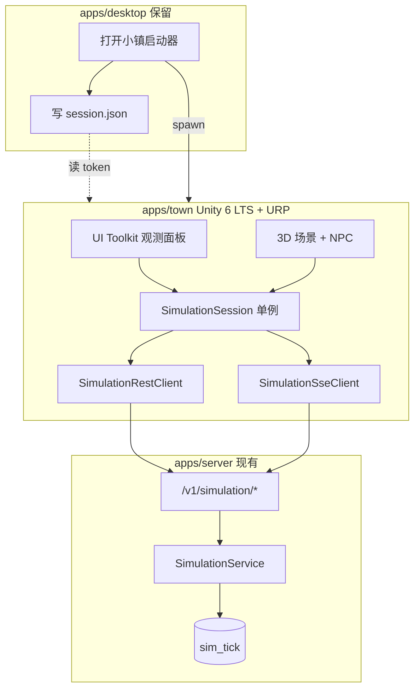

# AgentTown 客户端规格（Unity 6 LTS 独立应用 · 路线 B）

> **状态（2026-07-10）**：**Unity Phase 0/1 + Offline Demo + 观测层**已进仓；HUD 为**顶栏/底栏/左右轨**（顶栏 **fps-label** 色带 ≥30/20/&lt;20）。建筑距离 LOD + `pnpm town:serve:webgl`（`?demo=1`）。`town:verify` EditMode 绿。CORS/WebGL Step A ✅；WebGL C2 live ✅；Desktop `#/simulation/town` **仅启动器** ✅；**UE + Desktop R3F 已删**。scripted 可演示。
> **收口决策（2026-07-09）**：删栈以 **scripted + WebGL C2 live + FPS 顶栏**为准；**真 LLM 涌现验证另线**（不挡删栈 / §14 收口）。
> **决策（2026-07-08）**：观测客户端为 **Unity 6 LTS + URP + C#**（Low-Poly）；产品名 **AgentTown**，路径 `apps/town/`。决定性理由：中期 **Web 传播版**需原生 WebGL2。详见 §15。
> **不变量**：**后端 `simulation/`、REST/SSE 契约、Postgres 四表、`packages/protocol-conformance` fixtures 全部复用、零改动**（非路线 C 全栈分叉）。
> **开发口径**：单人开发者 + 全程 AI 辅助。日常入口：`pnpm town:open` / `pnpm town:verify`；见 `apps/town/README.md`。
> **背景**：[AI 小镇 MVP 开发计划](AI小镇MVP开发计划.md)；画面为长期卖点，且需 Web 传播版。
> **关联**：坐标契约 → `packages/protocol-conformance/fixtures/simulation-region-positions.json`；类型 → `packages/contract-types`、`apps/server/agentcore/simulation/types.py`

---

## 1. 产品定位

| 维度 | 定案 |
|------|------|
| 产品名（工作名） | **AgentTown**（Unity 打包产物：Phase 1 Windows `AgentTown.exe`；**中期 WebGL 传播版**——浏览器直达、无需安装） |
| 引擎 | **Unity 6 LTS + URP + C#**（Low-Poly 低模） |
| 角色 | AgentCore **模拟观测客户端**——与 Desktop（协作/聊天）并列入口，**同一账号、同一后端** |
| 核心价值 | 「好看、能看的 3D AI 小镇」观看体验；手动 tick + 连续回放 |
| 主入口 | **直接启动 AgentTown**（独立安装包 / WebGL 页面） |
| 副入口 | AgentCore Desktop「打开小镇」→ 启动子进程并传入 `--run-id` / token |
| 非目标 | 不重写 Python WorldEngine；不 fork 后端仓库；MVP 不做完整 OAuth 登录 UI |

**用户路径**

1. 直接启动 `AgentTown` → 读 token / 配置 API → 创建或恢复 run → 观看
2. Desktop 菜单「打开小镇」→ `AgentTown.exe --api … --token … [--run-id …]`
3. （中期）浏览器打开 WebGL 传播版 → URL query / 同源会话取 token → 观看

**M4 验收口径（与 MVP 对齐）**：「非技术用户可观看模拟」= 在 **AgentTown** 内完成观察 + 跟踪 + 回放；Desktop 仅作可选启动器，不再要求内嵌 3D 页。

---

## 2. 架构总览



**铁律**

1. **模拟真相在后端**：tick 快照（`sim_tick`）为位置与 agent 状态的权威源。
2. **Unity 只消费契约**：REST + SSE；不内嵌 LLM、不本地推算 tick。
3. **单一客户端状态机**：`SimulationSession` 为唯一会话真相（禁止 React 式多 store）。
4. **Live / Replay 共用 `ApplySnapshot`**：差异仅在插值 vs 瞬移、是否处理 SSE 增量。
5. **坐标变换单点**：Wire 坐标（Y-up 右手系，x 东、z 南）→ Unity Y-up 左手系，仅在 `ApplySnapshot` 内变换（§6.2）。

---

## 3. 仓库布局

**当前布局**（Unity-only；**UE 与 Desktop R3F 已删**）：

```
AgentCore/
├── apps/
│   ├── server/                      # 不动
│   ├── desktop/                     # session.json + 启动器 IPC（✅）；`#/simulation/town` 仅 Launcher
│   └── town/                        # Unity 6 LTS + URP（唯一 3D 客户端）
│       ├── Assets/
│       │   ├── Scripts/             # Simulation / Town / UI（C#）
│       │   ├── Scenes/Town.unity
│       │   ├── UI/                  # UI Toolkit UXML/USS + PanelSettings（顶栏含 fps-label）
│       │   ├── Settings/            # URP Asset
│       │   ├── Plugins/WebGL/       # AgentTownSse.jslib
│       │   ├── StreamingAssets/     # Fixtures + town-personas.json
│       │   ├── Editor/              # ProjectSetup / BatchVerify
│       │   └── Tests/EditMode/
│       ├── Packages/manifest.json   # URP、AI Navigation、Newtonsoft.Json、Test Framework
│       ├── ProjectSettings/         # 6000.0.78f1
│       └── scripts/                 # open-unity / verify-unity / build-unity / spike-webgl
├── packages/
│   ├── town-assets/                 # 3D 资产单一源（⏳ 尚未迁入；源仍在 desktop/public）
│   ├── contract-types/
│   └── protocol-conformance/fixtures/
│       ├── simulation-region-positions.json
│       └── simulation-m1-tick.json
```

场景与区域锚点**运行时代码生成**；真资产（Kenney/Xbot）导入后替换 primitive。日常文档：`apps/town/README.md`、`EDITOR-WIRING.md`。

**Desktop 保留（路线 B）**

| 组件 | 状态 | 职责 |
|------|:----:|------|
| `session.json` 写入 | ✅ | `main/agenttown-service.ts`；登录后持久化 API + token（§8） |
| 「打开 AgentTown」按钮 / spawn | ✅ | `OpenInAgentTownButton`；需本机 `AgentTown.exe` |
| `/simulation/town` 路由 | ✅ | **仅** `TownLauncherPage`（无内嵌 3D / 无 `?preview`） |

新需求只进 Unity。

---

## 4. SimulationSession 状态机

### 4.1 状态字段

| 字段 | 类型 | 说明 |
|------|------|------|
| `runId` | string? | 当前 run |
| `scenario` | string | 默认 `"town"` |
| `tick` | int | run 尾部 tick |
| `hour` | int | 时钟显示 |
| `status` | enum | `active` \| `paused` \| `completed` |
| `mode` | enum | `Live` \| `Replay` |
| `playhead` | int? | `null` = live 尾部 |
| `playing` | bool | 自动连播 |
| `playbackSpeed` | float | 0.5 / 1 / 2 / 4 |
| `agents` | Map | UI + 3D 共用 |
| `tickCache` | Map\<tick, Snapshot\> | 客户端缓存 |
| `decisions` | List | `sim.agent_action`（最近 50） |
| `tickEvents` | List | 全事件（最近 400） |
| `manifest` | RunManifest? | **权威 roster**（`GET /manifest`） |
| `streamStatus` | enum | SSE 连接态 |
| `ticking` | bool | 等待 advance |
| `selectedAgentId` / `trackedAgentId` | string? | 选中 / 相机跟随 |

### 4.2 模式规则

| 条件 | SSE | 位置更新 |
|------|-----|----------|
| Live，`playhead == null` | 处理 `tick_started/ended`、`agent_*`、`interaction`、`world_event`；**忽略 `tick_frame`** | `tick_ended` 后 **仅** `GET /ticks/{n}` → `ApplySnapshot`；**不使用** `advance_tick` 响应内 snapshot 直接 apply |
| Replay 或 `playhead != null` | **忽略**改变世界状态的 SSE | **仅** `GET /ticks/{playhead}` → `ApplySnapshot`；NPC snap |
| `playing` | 同 Replay | 定时 `playhead++` → Seek |
| `playhead >= tick` | 切 Live | `GoLive()` + 拉最新帧 |

**Replay 数据源（定案）**：Phase 1–3 **仅** `GET /ticks/{n}` 逐帧拉取；**不用** `GET /replay` SSE（避免双路径）。

### 4.3 ApplySnapshot

1. 对每个 agent：`wirePos` → `unityPos = (wire.x, wire.y, -wire.z)`（§6.2）
2. 合并 `manifest.personas` 的 `big_five`；bio 见 §6.4
3. Replay：`Transform.position` 瞬移；Live：`NavMeshAgent.SetDestination` 设目标
4. 纯视觉偏移 `spawnOffset`（§6.5）加在 Unity 侧，**不改** wire 坐标
5. 更新 UI、`tickCache`

---

## 5. REST API 映射

基址：`{apiBase}/v1/simulation`

| 动作 | 方法 | 路径 | Phase |
|------|------|------|-------|
| 创建 run | POST | `/runs` | P0 |
| 推进 tick | POST | `/runs/{id}/tick` | P0 |
| 读历史帧 | GET | `/runs/{id}/ticks/{n}` | P0 |
| Live SSE | GET | `/runs/{id}/stream` | P1 |
| **Manifest（roster 权威）** | GET | `/runs/{id}/manifest` | **P1** |
| 暂停/继续 | POST | `/runs/{id}/pause` \| `/resume` | P1 |
| 指标 | GET | `/runs/{id}/metrics` | P2 |
| 注入/改 agent | POST `/inject`、PATCH `/agents/{id}` | P3（对齐 MVP M3） |
| Run 列表 | GET | `/runs` | **中期后端增项**（BE-UT-01）；MVP 用本地历史 |

**POST /runs body**：`{ "scenario": "town", "seed?": int, "manifest?": object }`

**启用门禁**：`SIMULATION_ENABLED=true`

---

## 6. 数据契约

### 6.1 SimTickSnapshot

与 `agentcore.simulation.types.SimTickSnapshot` 一致（含 `tick_memories`、`governance`、`active_events`、`modifiers`、`metrics`）。C# DTO class + `Newtonsoft.Json`（`com.unity.nuget.newtonsoft-json`，处理字典/嵌套/可选字段）手写对齐 OpenAPI。

### 6.2 坐标系（已定案 · Unity）

| 空间 | 约定 |
|------|------|
| Wire / 后端 / fixture | **Y-up 右手系**；`x` 东、`z` 南、`y` 上（注释见 `vec3.py`、`contract-types`） |
| Unity 场景 | **Y-up 左手系**；**单点变换**（世界比例 `S = 1`，1 wire 单位 = 1 米 = 1 Unity 单位——Unity 基础单位即米，无需 ×100）：`unity = (wire.x, wire.y, -wire.z) × S` → `Vector3(x, y, z)`。 |

**推导**：wire 与 Unity 同为 Y-up，故「上」轴（`y`）直传；两者手性不同（wire 右手、Unity 左手），须**恰翻一个轴**以避免镜像——按 glTF/Three.js→Unity 标准约定**翻 `z`**（wire 的 `+z`=南 → Unity `+z`=前=北）。R3F 参照（`regionPositions.ts`）在 Three.js（Y-up 右手）中直接使用 wire `(x,y,z)`，Unity 仅比其多一次 `z` 取反即得同一视觉布局。NPC 尺寸/速度本以米计，随 `S=1` 天然对齐，无额外缩放。

**验收 oracle**：`市场` wire `(36,0,0)` → Unity 世界坐标 **`(36, 0, 0)`**。须加 **Unity Test Framework（EditMode，NUnit）单测**读 `simulation-region-positions.json`（`Assets/StreamingAssets/Fixtures/` 同步副本），逐区域断言变换结果**误差 < 0.5m**。

> `contract-types` 注释改为「Wire 世界坐标（客户端自行映射至引擎坐标系）」。

### 6.3 区域锚点

单一源：`simulation-region-positions.json` → Unity `Assets/StreamingAssets/Fixtures/`（构建或 Editor 脚本同步自 protocol-conformance）。

10 区域：`广场`、`市场`、`餐厅`、`面包店`、`公园`、`住宅区`、`镇政厅`、`图书馆`、`工坊`、`码头`。世界草地约 **120×96 m**；默认鸟瞰相机约高度 28（可滚轮缩放；HUD「鸟瞰」回全景）。

### 6.4 居民人设（已定案）

| 数据 | 权威源 |
|------|--------|
| `agent_id`、姓名、职业、`big_five`、regions | **`GET /runs/{id}/manifest`**（创建 run 后拉取） |
| `bio`、展示用关系文案 | 本地 `town-personas.json`（自 `townPersonas.ts` 导出）直至后端 manifest 补字段 |
| 运行时动态字段 | `SimTickSnapshot.agents` |

### 6.5 视觉偏移（非权威）

同区域多 NPC 防堆叠：Unity 侧 `spawnOffset` 表（对齐 Desktop `TOWN_SPAWN_OFFSET`，`z` 符号随 §6.2 wire→Unity 变换），**仅影响渲染**，不参与后端位置回写。

### 6.6 SSE 事件处理

| 事件 | Live | Replay | 动作 |
|------|:----:|:------:|------|
| `sim.tick_started` | ✅ | ❌ | `ticking=true` |
| `sim.tick_ended` | ✅ | ❌ | `ticking=false`；`GET /ticks/{n}` → Apply |
| `sim.agent_action` | ✅ | ❌ | `pushDecision` |
| `sim.agent_state` | ✅ | ❌ | 更新 agent；Live 可预置 nav |
| `sim.interaction` | ✅ | ❌ | 事件流；3D 叠加 Phase 3 |
| `sim.world_event` | ✅ | ❌ | 事件流；修饰符 UI P2 |
| `sim.tick_frame` | **❌ 忽略** | 可选（仍优先 GET） | 避免与 tick_ended 双路径 |

### 6.7 契约漂移清单（已知，对齐责任）

| 项 | 现状 | 处理 |
|----|------|------|
| `sim.tick_started.agent_count` | fixture 有，TS 类型无 | Unity/C# 容忍可选字段 |
| `SimTickEndedPayload.metrics` | Python 有，TS 无 | Unity 读可选 `metrics` |
| Vec3 注释写 R3F | 历史遗留 | 改注释为 Wire 坐标 |

---

## 7. Unity 场景与 NPC

| 层 | 职责 |
|----|------|
| Bootstrap（MonoBehaviour）| 配置、认证、`SimulationSession` 装配 |
| TownScene | 空场景 + **运行时代码生成**地形、Kenney 建筑、区域锚点；`NavMeshSurface` 运行时烘焙 |
| NpcLayer | NPC 预制体 + `NavMeshAgent` + `Animator`；`agent_id` 与后端一致 |
| CameraRig | 鸟瞰 + 跟踪 |
| UiLayer | UI Toolkit（`UIDocument`）观测 chrome |

**UI 选型（定案）**：**UI Toolkit（UXML/USS + `UIDocument`）**——观测面板数据密集，retained-mode + flexbox/USS 与 Web/DOM 经验同构。**例外**：世界内气泡 / 头顶名牌走 **uGUI world-space Canvas**（Unity 6 中 UI Toolkit world-space 仍为实验特性）。

**观测 chrome 布局（2026-07-09 · 行业观测台惯例）**——`Assets/UI/TownHud.uxml` + `TownHudController`；中央留给 3D，勿再把决策/事件浮在画面正中：

| 区域 | 内容 |
|------|------|
| **顶栏** | 状态 / 时钟 / Tick / SSE · 宏观 metrics chips · 世界修饰符 · 鸟瞰 |
| **底栏** | 推进/暂停/继续 · 回放 ◀▶ Live · **时间轴滑块** · 倍速 |
| **左侧轨** | 运行（离线 Demo / 新建 / 恢复 / 最近 Run）· 上帝模式 4 预设 |
| **右侧轨** | **居民 / 决策 / 事件** 三 Tab（检验区；默认居民） |
| **中央** | 3D 小镇（picking 穿透，仅 chrome 吃指针） |

**NPC 渲染（定案）**：单骨骼 FBX/glTF（`Xbot`）**共享骨骼动画 + 预制体实例化**，`MaterialPropertyBlock` 标色区分居民（对齐现 Desktop，非每人独立 Mixamo 文件）。

**资产（定案）**：`packages/town-assets/` 为单一源；自 `apps/desktop/public/simulation/assets/` 迁出或 CI 同步脚本导入 Unity `Assets/`，避免双份手工维护。Kenney / Quaternius（CC0）+ 其它免费包可选用。

**性能**：10 NPC ≥ 30 FPS（Windows 中端 GPU）。

**引擎版本**：**Unity 6 LTS（6000.x LTS）+ URP**（以 `ProjectSettings/ProjectVersion.txt` 为准）。

**平台**：Phase 1 **Windows**；**WebGL 传播版为中期战略目标**（本次迁移的决定性理由，连通性 spike 见 §15）；macOS Phase 3。

---

## 8. 认证与配置（已定案）

### 8.1 Phase 0 Spike

- 开发环境：`Authorization: Bearer <access_token>`（手写 token 或 dev 登录复制）
- 启动参数（桌面构建）：`--api <url> --token <token> [--run-id <id>]`
- WebGL 构建无 CLI 参数：改从 URL query（`?api=…&token=…&run=…`）或同源会话读取

### 8.2 Phase 1+ Token 文件（Desktop 并行实现）

路径：`%APPDATA%/AgentCore/session.json`（macOS：`~/Library/Application Support/AgentCore/session.json`）

```json
{
  "api_base": "http://localhost:8000",
  "access_token": "<jwt or session token>",
  "refresh_token": "<optional>",
  "expires_at": "<ISO8601 optional>"
}
```

| 职责 | 方 |
|------|-----|
| 写入 | **Desktop** 登录成功后 |
| 读取 | **AgentTown（桌面构建）** 启动时；Bearer 优先 |
| 401 | 尝试 refresh（若存在 `refresh_token`）；失败则提示打开 Desktop 登录 |

> **WebGL**：无本地文件系统，不读 `session.json`；token 走 URL query / 同源 cookie / 宿主页 `postMessage`（Phase 3 产品化时定稿）。

### 8.3 产品化（Phase 3）

- Unity 内嵌登录页 / 设备码 OAuth（桌面与 WebGL 各自适配）

---

## 9. Run 生命周期与本地历史

| 阶段 | 策略 |
|------|------|
| MVP | 本地 JSON（`Application.persistentDataPath`）/ `PlayerPrefs` 保存最近 12 个 run（对齐 Desktop `runHistory.ts` 语义）；支持 `--run-id` 恢复。WebGL 用 `PlayerPrefs`（IndexedDB 后端） |
| 中期 | 后端 **BE-UT-01**：`GET /v1/simulation/runs` 列表（用户维度） |
| 互通 | 可选读取同一 `agentcore:simulation-run-history` 键（低优先级） |

---

## 10. Desktop 启动器集成

| 项 | 定案 |
|----|------|
| UX | Desktop「打开小镇」→ `Process.Start(AgentTown.exe, args)` |
| 参数 | `--api {VITE_API_URL} --token {from session} [--run-id {current}]` |
| 路径发现 | 同目录 / `Program Files/AgentCore/AgentTown/` / 环境变量 `AGENTTOWN_PATH` |
| 错误 | 未找到 exe → 提示安装 AgentTown 独立包 |
| 深链 | Phase 2：`agenttown://open?run=…`；Phase 1 仅 CLI |

---

## 11. Desktop R3F → Unity 功能迁移对照

> Unity 亦可参照现有 UE C++ 实现（双参照）；下表以 R3F 组件为锚列出 Unity 各 Phase 归属。

| Desktop 组件 | Unity Phase | 说明 |
|-------------|-------------|------|
| `TownCanvas` / `town/*` | P0–P1 | 3D 场景整体替换 |
| `SimulationRunManager` | P1 | Run 管理 UI |
| `TickControlBar` | P1 | 推 tick / pause |
| `SimulationPlaybackControls` | P1 | 回放、倍速、跳转 |
| `ResidentsPanel` | P1 | + manifest roster |
| `DecisionPanel` | P2 | |
| `EventTimelinePanel` | P2 | |
| `TrackingCamera` | P2 | |
| `ObservationPanel` + metrics | P2 | `GET /metrics` |
| `TownRegionHeatmap` | P2 | 区域情绪色块 |
| `TownLighting` / `dayNight` | P2 | 日夜光照 |
| `InteractionOverlays` | P3 | 对齐 MVP M3 |
| `GodModePanel` | P3 | inject / patch |
| `?preview=1` / Desktop R3F | ✅ 已删 | 观测仅在 AgentTown |

---

## 12. 测试与 Smoke

| 层级 | 门禁 |
|------|------|
| HTTP | 保留 `pnpm -C apps/desktop sim:smoke:e2e`（测 API+SSE，非 3D） |
| Conformance | Unity Test Framework（EditMode）消费 `simulation-m1-tick.json` + region fixture |
| Unity | Phase 0：`WireCoordinateTransform` EditMode 单测（市场 oracle）；Phase 1：Play Mode smoke + 打包 smoke（**Windows + WebGL** 双目标） |
| 渲染 | `shoot-simulation-town*.mjs` 退役后由 Unity 截图测试替代 |

---

## 13. 分阶段交付

### Phase 0 — Spike（~1–2 周）

- [x] `apps/town` Unity 6 + Bearer REST 客户端（create / tick / GET ticks）— 代码 ✅；打包 E2E ⏳
- [x] 坐标变换（`市场 (36,0,0)` → `(36,0,0)`）+ EditMode 单测 + 占位 NPC / NavMesh
- [x] WebGL SSE **源码桥**（`AgentTownSse.jslib` + `WebGlSseTransport`）
- [x] Desktop：`session.json` 写入（`agenttown-service.ts`）
- [x] **CORS + 浏览器 SSE 路径**（`pnpm town:spike:webgl` Step A；`.env` 含 `:8080`）
- [x] WebGL **构建产物**（`Builds/WebGL/`）
- [x] **Go/No-Go**：CORS+SSE Step A 绿；WebGL 可构建；jslib 页内冒烟见 `pnpm town:spike:webgl`（C2）

### Phase 1 — 可观看 MVP（~2–3 周）

- [x] 10 区域运行时建镇 + Session 单状态机 + 多 NPC
- [x] SSE live + GET 回放/倍速 + manifest 居民列表（HUD）
- [x] Tick 控制 UI（Create / Advance / Replay）
- [x] Kenney + Xbot 资产管线（`town:sync-assets` + Import；无资产回退占位）；FE-18：Quaternius 源已进（精选 10 栋）+ 区域绑定（Quaternius 优先 / Kenney fallback）；公园自然物：Kenney Nature Kit 精选 10 GLB + nature 池；主干道路：Kenney City Kit (Roads) 精选 8 GLB + road 池（无资产回退色块）+ LOD/剔除守 10 NPC ≥ 30 FPS
- [x] 本地 Run 历史（§9，最近 12 条）
- [x] Windows `AgentTown.exe` + WebGL 构建；`pnpm town:build` / `town:verify`（29/29）
- [x] Desktop 路由仅启动器（`#/simulation/town` → `TownLauncherPage`；失败路径提示；开发期找 `Builds/Windows/AgentTown.exe`）
- [x] Offline Demo（`--demo` / 左侧轨「离线 Demo」；含交互/metrics/modifiers）
- [x] **删栈收口**：UE + Desktop R3F 已删；门禁 = scripted + WebGL C2 live（`sim.tick_*`）+ 顶栏 FPS 可目测
- [ ] 真 LLM 连推 5+ tick（需 DeepSeek；**另线**，不挡删栈）
- [x] 30 FPS 可观测固化（顶栏 fps-label 色带 + `FpsSampler` EditMode；Profiler 深度采样另跟）

### Phase 2 — 体验对齐（~2 周）

- [x] 决策/事件（右侧 Tab；顶栏 metrics / 修饰符）
- [x] 跟踪相机
- [x] 日夜光照
- [x] 热力 / metrics（区域 mood·密度热力 + 顶栏 metrics；Offline / scripted 可演示）
- [x] 观测 chrome 重排（顶栏状态 · 底栏时间轴 · 左右轨；中央留给 3D）
- [ ] Token 文件联调（401 refresh）

### Phase 3 — 产品化

- [x] 上帝模式 + 交互 3D 叠加（左侧轨 4 预设；Offline / scripted 可演示对话·交易·投票叠加）
- [ ] Unity CI、Windows 安装包、**WebGL 传播版发布**
- [ ] macOS 构建
- [ ] `sim.*` conformance 扩展

---


## 14. 验收标准（Phase 1）

**删栈收口（已定）**：以 **scripted + WebGL C2 live（见 `sim.tick_*`）+ 顶栏 FPS 可目测**为准；**真 LLM 涌现验证另线**，不列入删栈门禁。

| # | 项 | 状态 |
|---|----|:----:|
| 1 | 独立启动 AgentTown（token 文件或 CLI） | ✅ |
| 2 | 创建 run → `GET /manifest` → 10 居民 roster | ✅ |
| 3 | 手动 / scripted 5 tick；位置与 region fixture 一致 | ✅ scripted |
| 4 | 回放 seek / 倍速，无 SSE 污染 | ✅ |
| 5 | 顶栏 `fps-label` 可目测（≥30 绿 / 20–29 黄 / &lt;20 红）；`FpsSampler` 门禁；Profiler 深度另跟 | ✅ 可观测 / Profiler 另跟 |
| 6 | WebGL 构建 SSE live tick（C2 / `pnpm town:spike:webgl`） | ✅ |
| 7 | 删除 UE + Desktop R3F | ✅ |
| — | 真 LLM 连推 5+ tick | 另线（需 DeepSeek） |

---

## 15. 从 UE / R3F 迁移（已完成退役）

> **背景**：2026-07-08 选定 **Unity 6 LTS + URP + C#**（决定性理由：Web 传播版需原生 WebGL2）。**2026-07-09**：Unity Phase 0/1 进仓后，按收口决策**已删除** UE（`Source/` / `.uproject` / `Config/` / `Content/` / `town:ue:*`）与 Desktop R3F（`simulation/town/**`、内嵌 3D 页、`town:preview` / `shoot:simulation`）。历史以 git 为准，不设归档目录。

### 15.1 仍复用（零改动）

| 类别 | 复用物 |
|------|--------|
| 后端 | `simulation/`、REST/SSE、Postgres 四表 |
| Fixtures | `simulation-region-positions.json`、`simulation-m1-tick.json` → `Assets/StreamingAssets/Fixtures/` |
| 类型契约 | `packages/contract-types` / OpenAPI → 手写 C# DTO |
| 资产 | `packages/town-assets`（Kenney/Quaternius）→ Unity `Assets/` |
| 人设 | `town-personas.json` |

### 15.2 移植进度

1–6. CORS / 坐标 / Session / 建镇 / NPC / UI Toolkit → ✅  
7. WebGL C2 live + 删 UE/R3F → ✅  
余项：真 LLM 另线；Profiler 深度采样（顶栏 FPS 色带已可观测）。

### 15.3 引擎无关契约（仍不变）

`SimulationSession` 状态机、Live/Replay、SSE 事件表、REST、wire 坐标语义、fixtures。**若须改契约 → 停下回报，不自行改。**

---

## 16. 已定案决策摘要

| # | 决策 |
|---|------|
| 1 | 认证：Spike 用 Bearer；并行 Desktop 写 `session.json`（WebGL 走 URL/同源） |
| 2 | 坐标：wire → Unity `(x, y, -z)` 单点变换（Y-up 左手系，`S=1` 米）；市场 `(24,0,0)`→`(24,0,0)` |
| 3 | Roster：`GET /manifest` 权威；bio 本地 JSON 兜底 |
| 4 | Run 历史：本地缓存 + 中期 `GET /runs` |
| 5 | 主入口 AgentTown；Desktop 仅启动器副入口（无内嵌 3D） |
| 6 | **UE + Desktop R3F 已删**；删栈门禁 = scripted + WebGL C2 live + FPS 顶栏；真 LLM 另线 |
| 7 | 资产 `packages/town-assets`（CC0 Kenney/Quaternius + 免费包） |
| 8 | **Unity 6 LTS + URP**；Windows 先行、**WebGL 中期**、macOS 后 |
| 9 | Replay 仅 GET 逐帧；Live 忽略 `tick_frame` |
| 10 | MVP FE 任务映射为 **UT-***（Unity Town；见 MVP 计划 §2.1） |
| 11 | UI 选型 UI Toolkit（世界内气泡例外走 uGUI world-space）；JSON 用 Newtonsoft |
| 12 | **2026-07-08**：选定 Unity（WebGL2）；**2026-07-09**：UE/R3F 退役完成（§15） |

---

## 相关文档

- [AI 小镇 MVP 开发计划](AI小镇MVP开发计划.md)（§2.1 UT 任务映射）
- [多 AI 模拟愿景](multi-ai-simulation-vision.md)
- 后端 → `apps/server/agentcore/api/routes/simulation/runs.py`
