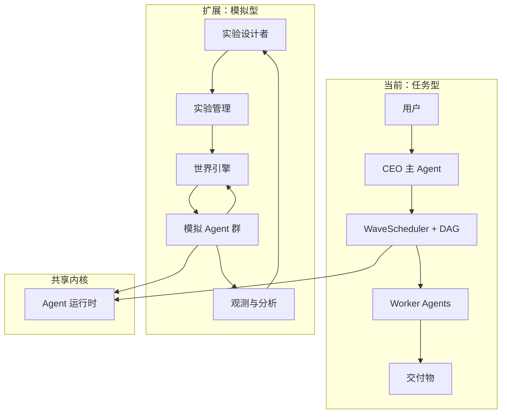
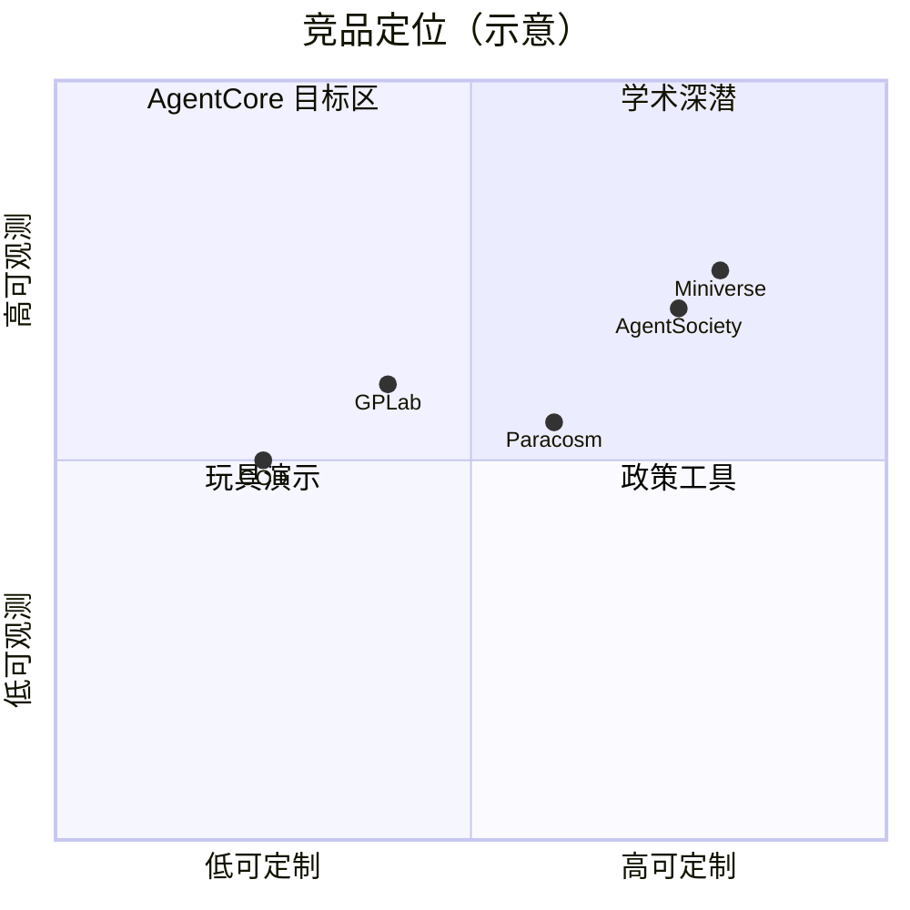

# 通用多 AI 模拟平台：愿景与路线图

> **定位**：AgentCore 从「任务型多 Agent 协作平台」向「通用多 AI 模拟平台」扩展的战略规划。面向产品与技术决策者。
>
> **状态**：🗂️ 战略蓝图（方向已确认，未承诺落地）

---

## 一、愿景与定位

### 1.1 一句话

**不只是帮人完成任务的多 Agent，而是把 LLM Agent 当成可编程的「模拟人」——赋予不同角色、知识、目标、约束，放进共享环境，让它们自主交互，观察涌现行为。**

### 1.2 根本区别：任务型 vs 模拟型

| 维度 | 任务型多 Agent（当前 AgentCore） | 通用多 AI 模拟 |
|------|----------------------------------|----------------|
| **驱动力** | 外部任务：用户下达目标，Agent 为交付物服务 | 内生动机：角色自带目标、偏好、恐惧、利益，环境变化驱动行为 |
| **Agent 间关系** | 协作为主：分工、互审、产物中转；竞争/欺骗是异常 | 关系谱系丰富：竞争、合作、欺骗、结盟、背叛、舆论动员均为设计要素 |
| **终止条件** | 任务完成 / 用户取消 / 收敛守卫触发 | 持续运行：按 tick/回合/事件推进，可跑数小时至数周 |
| **涌现** | 多为 **bug**（角色漂移、越权、幻觉）需抑制 | **核心价值**：市场泡沫、联盟破裂、极化螺旋等不可预先写死的宏观模式 |
| **人的角色** | 用户 / 委托人：定目标、拍板、验收 | 实验设计者 / 观察者：设场景、调参数、记录、对比分叉，一般不介入单次决策 |
| **成功标准** | 交付质量、成本、时延 | 可复现、可解释、机制可发现、反事实可对比 |

### 1.3 与现有定位的关系

AgentCore 当前品类是**协作智能平台**——用户是「领导者」，CEO Agent 带队完成复杂任务。模拟平台不是替代，而是**同一内核上的第二增长曲线**：

- **共享**：Agent 运行时、记忆系统、多模型编排、SSE 可观测、审计与回放
- **新增**：世界状态机、内生动机循环、结构化交互协议（市场/投票/辩论等）、实验管理与分叉对比
- **用户心智迁移**：从「我是老板，团队替我干活」到「我是实验者，观察一群模拟人如何演化」

---

## 二、目标应用场景

每个场景的核心价值是**低成本反事实**与**不可能实验的替代**——真实世界无法或不应做的干预，在模拟中可重复、可分叉、可量化。

### 2.1 经济学仿真

| 子场景 | 具体例子 | 观测目标 |
|--------|----------|----------|
| 货币政策沙盘 | 100 个「家庭-企业-银行」Agent，央行 Agent 调整利率与 QE | 通胀预期、失业率、资产价格传导时滞 |
| 市场微观结构 | 做市商、散户、机构在同一订单簿上交易 | 闪崩、流动性枯竭、做市商撤单连锁 |
| 制度比较 | 同一经济体分别运行「价格管制」与「自由定价」两个分叉 | 短缺、黑市、福利损失的机制差异 |
| 关税冲击 | 出口商、进口商、消费者、政策制定者四方博弈 | 贸易战下的产业转移与消费者福利（参考 Shachi 关税 ABM 思路） |

### 2.2 博弈论湿实验（Wet Lab）

| 子场景 | 具体例子 | 观测目标 |
|--------|----------|----------|
| 重复囚徒困境锦标赛 | 多种策略 Agent（以牙还牙、随机、深度学习策略等）多轮配对 | 合作率演化、策略支配关系 |
| 公共品博弈 | N 人决定是否向公共池出资，出资多者吃亏 | 搭便车率、惩罚机制有效性 |
| 拍卖设计验证 | 英式/荷式/维克里拍卖，竞标 Agent 有不同估值与预算 | 收益等价性、合谋可能性 |
| 多方协商与联盟 | 5 党议会 Agent 就预算案谈判、威胁解散联盟 | 稳定联盟结构、否决玩家权力 |

### 2.3 社会学 / 政治学沙盘

| 子场景 | 具体例子 | 观测目标 |
|--------|----------|----------|
| 舆论极化 | 左/中/右 Agent 在社交网络中发帖、点赞、取关 | 回声室形成速度、温和派消失条件 |
| 假新闻扩散 | 事实核查 Agent vs 谣言源 Agent，用户信任度异质 | 辟谣有效性、滞后窗口 |
| 制度演化 | 社区从习惯法到成文法的多代 Agent 迭代 | 规范内化、执法成本权衡 |
| 选举模拟 | 候选人、媒体、选民、金主四方互动 | 摇摆州、负面广告效应、投票率 |

### 2.4 组织行为与管理学

| 子场景 | 具体例子 | 观测目标 |
|--------|----------|----------|
| 企业治理 | CEO、董事会、中层、一线员工，信息不对称 | 代理成本、激励扭曲、甩锅链 |
| 创新扩散 | 早期采用者、怀疑者、监管者在一个产品生态中 | S 曲线拐点、标准战争 |
| 供应链韧性 | 多级供应商 + 物流 + 需求冲击 | 断链传播、库存策略比较 |

### 2.5 哲学 / 伦理学思想实验

| 子场景 | 具体例子 | 观测目标 |
|--------|----------|----------|
| 电车难题群体版 | 50 个路人 Agent 各自道德直觉不同，共遇伦理困境 | 多数决 vs 原则主义的分歧分布 |
| 社会契约论实证化 | 无知之幕下的 Agent 谈判权利与义务 | 罗尔斯式差异原则是否自发涌现 |
| 道德直觉涌现 | 无预设伦理规则，仅给生存/声誉激励 | 惩罚第三方、互惠规范是否自发出现 |

---

## 三、技术架构概要

### 3.1 与当前 AgentCore 的关系



**扩展路径（非推倒重来）**：

1. **保留** `WaveScheduler`、Turn Journal、SSE 事件流、记忆注入、多模型 Profile——作为单 tick 内 Agent 决策的执行层
2. **新增** `SimulationRun` 生命周期，与 `Conversation/Turn` 并行：模拟 run 跨多 tick，每 tick 可触发一批 Agent 决策
3. **复用** 辩论编排、审批门、审计轨迹——升级为「结构化交互协议」的首批实现
4. **扩展** 前端：从「协作图」到「世界观测台」（时间轴、热力图、分叉对比）

#### 在本项目扩展（✅ 已确认）

**不新开项目**，在 `apps/server/agentcore/` 下新增顶层包 `simulation/`，与 `runtime/`、`conversation/` 并列：

| 子包 | 职责 |
|------|------|
| `world/` | WorldEngine：状态、tick 推进、规则、事件注入 |
| `agents/` | SimAgent：角色人设、动机层、行为循环 |
| `interaction/` | 交互协议：对话、市场、投票、博弈 |
| `observe/` | 观测：指标聚合、涌现检测 |
| `experiment/` | 实验管理：场景配置、种子、分叉 |
| `scenarios/` | 场景层：`town/`、`game_theory/`、`economy/` |

**核心依赖关系**：模拟引擎是现有运行时的「上层」，不是「并列」——

```
WorldEngine 驱动 tick 推进
  → 每 tick 内复用 WaveScheduler 调度 Agent
    → 每个 Agent 复用 ReAct 做决策
      → LLM 推理走现有网关
```

**架构张力处理**：以下约束位于 `runtime/runs/` 与 `conversation/` 层，不在 `runtime/engine/`（ReAct）层——模拟引擎跳过前两者，直接复用后者：

| 任务型约束 | 模拟型处理 |
|------------|------------|
| Worker 禁止直连 | 用新的 InteractionBus，不走 delegate 路径 |
| CEO 唯一入口 | 模拟无 CEO，WorldEngine 是入口 |
| DAG + depends_on | 用场景图，不用 DAG |

**前端技术栈（✅ 已确认：3D 路线）**

直接采用 3D 低多边形（Low-Poly）风格，不经过 2D 过渡阶段。

> **客户端实现路线（2026-07-08）**：观测层为 **Unity 6 LTS + URP + C# 独立应用 AgentTown**（路线 B），不再在 Desktop 内嵌 R3F。详见 → [AgentTown 客户端规格](06-规划/AgentTown客户端规格.md)。

| 组件 | 选择 | 理由 |
|------|------|------|
| 观测客户端 | **Unity 6 LTS + URP + C#**（`apps/town` AgentTown） | **原生 WebGL2 支持中期 Web 传播版**；单人 + AI 下 C# 迭代快；低模无需 UE 重型渲染 → [AgentTown 客户端规格](06-规划/AgentTown客户端规格.md) |
| 3D 场景 | Unity URP + Kenney / Quaternius 免费资产 | Low-Poly；资产源 `apps/town/Assets/TownAssets` |
| NPC | NavMeshAgent + 动画状态机 | 单 FBX/GLB（Xbot）实例化区分居民 |
| 状态管理 | C# `SimulationSession` 单例 | 禁止多 store 分裂；对齐 tick 快照权威 |
| Desktop 角色 | 启动器 + `session.json` | 不再内嵌 3D；`?preview` / R3F **已删** |
| 场景资产 | Kenney + Quaternius（CC0）+ Unity Asset Store 免费区 | CC0 免费 low-poly 建筑/树木/道具 |

> **中期 Web 传播版（已确认）**：Unity 原生 WebGL2 使同一客户端可导出浏览器版 AI 小镇，服务大众 / 病毒性传播——这是本次选 Unity 而非 UE 的**决定性理由**（落地节点见「七·路线图 Phase 2」）。

视觉风格：Low-Poly（低多边形）+ 柔和色调 + 日夜循环。参考 Monument Valley / Polybridge 审美。

行业验证：ai-npc-world（3D AI 村庄引擎）、The Delegation（3D Agent 办公室）、Emergence World（3D 多 Agent 社会模拟）已证明技术可行性。

**数据库**：复用现有 Postgres + Alembic，新增四张表：

| 表 | 用途 |
|----|------|
| `simulation_run` | 模拟实验生命周期 |
| `sim_tick` | 每 tick 快照与元数据 |
| `sim_agent` | 模拟 Agent 状态与人设 |
| `sim_event` | 结构化交互与外部事件 |

### 3.2 核心模块

| 模块 | 职责 | 与现有组件关系 |
|------|------|----------------|
| **世界引擎（World Engine）** | 环境状态（资源、地理、制度参数）、离散/连续时间推进、物理与经济规则、外部冲击注入 | 新建；可借鉴执行引擎的「波次」概念做 tick 调度 |
| **Agent 运行时** | 角色人设（system persona）、分层记忆（情景/语义/程序性）、决策循环（感知→动机→行动）、内生动机（效用函数、目标栈、情绪标量） | 扩展现有 worker 运行时；动机层为新增 |
| **交互协议** | Agent 间通信契约：自由对话、市场交易、投票、拍卖、辩论、结盟/背叛声明 | 首批可复用 `debate`；市场/投票为新原语 |
| **观测与分析** | 全量实验记录、个体行为追踪、宏观指标聚合、涌现模式检测（聚类、突变点）、可视化 | 扩展 Turn Journal + 审计；新增指标管道 |
| **3D 观测前端** | Low-Poly 世界渲染（Unity AgentTown）、居民 NPC 寻路与动画、鸟瞰相机 + 观测面板、SSE 驱动 + tick 快照回放 | 独立客户端 `apps/town`；`SimulationSession`；复用 REST/SSE 契约 |
| **实验管理** | 场景 DSL/配置、参数网格、随机种子、分叉对比（A/B 世界）、可复现导出 | 新建；对接现有 conformance 向量思路 |

### 3.3 与任务型架构的关键差异

| 差异点 | 任务型 | 模拟型 |
|--------|--------|--------|
| 调度单位 | Turn / Wave（为用户交付服务） | Tick / Epoch（世界时钟推进） |
| Agent 拓扑 | DAG：CEO 委派，worker 不直连 | 全连接或场景图：任意 Agent 可交互 |
| 终止 | `finish_guard`、交付完成 | 时间上限、均衡检测、人工停止 |
| 状态权威 | 工作区文件 + Journal | **世界状态**为唯一事实源，Agent 记忆可对账 |
| 人的介入 | `ask_user`、审批门频繁 | 默认**零介入**；仅实验级参数调整 |
| 成功涌现 | 抑制漂移 | 记录并分类：预期涌现 vs 异常漂移 |

---

## 四、行业现状与竞品分析

2025–2026 年，LLM + ABM（基于主体的建模）交叉领域快速成熟。以下框架代表不同切入点：

| 框架 / 项目 | 机构 / 形态 | 核心特点 | 对 AgentCore 的启示 |
|-------------|-------------|----------|---------------------|
| **AgentSociety** | 清华 FIB-Lab | 10,000+ Agent 大规模社会模拟；城市级活动、交通、经济耦合 | 规模工程与分层激活（不是每 tick 全员推理） |
| **EconSimulacra** | 学术研究 | 跨域耦合的社会经济数字孪生 | 多子系统（劳动力、住房、金融）状态同步 |
| **SimCity** | LLM 宏观经济 | 用 LLM Agent 替代传统 DSGE 方程 | 宏观指标可从微观 Agent 行为聚合涌现 |
| **Emergence World** | 长时间线实验 | 连续多周自治 Agent 社会 | 长时间稳定性、行为漂移治理是硬问题 |
| **MASS** | 方法论框架 | 将 LLM-ABM **协议化**为定量研究方法 | 实验报告标准、可复现检查清单 |
| **CMASE** | 虚拟民族志 | 定性+定量混合的社会实验框架 | 个体叙事与宏观指标并重 |
| **Shachi** | 模块化 ABM | 模拟美国关税冲击的多主体贸易网络 | 政策冲击场景模板化 |
| **Miniverse** | CLI-first 框架 | 可审计、可脚本化的 Agent 模拟 | 开发者体验与实验可复现性 |
| **Paracosm** | 编译器范式 | 自然语言 what-if → 可运行多 Agent 世界 | 降低场景搭建门槛 |
| **GOD** | No-code 浏览器端 | 非技术用户可搭 Agent 社会 | 观测 UI 与上手路径 |
| **GPLab** | 政策模拟平台 | 面向决策者的通用政策沙盘 | ToG/ToB 商业化路径参考 |

### 竞争格局判断



**AgentCore 差异化机会**：竞品多偏「学术原型」或「单场景演示」。我们已有**生产级多 Agent 运行时、可观测 SSE、审计回放、桌面端可视化**——若补上世界引擎与实验管理，可走「可定制 + 高可观测 + 可复现」象限，服务研究与决策团队。

### AI 狼人杀 / 社交推理赛道（不选此方向）

| 产品 | 背景 | 特点 |
|------|------|------|
| **WhoisSpy.ai** | 淘宝旗下 | 已办高校赛事 |
| **Wolfcha** | 开源 | GitHub 613 stars |
| **BotMafia** | 独立产品 | 30+ 角色，支持最新模型 |
| **Mentiss Werewolf** | Steam | 即将上线 |
| 另有 2+ 同类产品 | — | 赛道合计 6+ 产品 |

**结论**：赛道已拥挤，且核心体验是「陪玩」而非「观察涌现」，与通用多 AI 愿景不符——故首个标杆场景不选 AI 狼人杀，也不做 AI 辩论（看点不足）。

> **传播钩子补丁（2026-07-09）**：对外大众入口改为**观众向 AI 恋综**（非陪玩、非 AI 伴侣）——甜虐赛制 + 竞猜/稀缺公投；小镇仍为中长期世界与引擎锚定场景。→ [AI 恋综场景提案](AI恋综场景提案.md)

---

## 五、核心技术挑战

| 挑战 | 表现 | 应对方向 |
|------|------|----------|
| **行为漂移（Behavioral Drift）** | 长运行后 Agent 忘记人设、目标稀释、同质化 | 定期人设锚定、动机层硬约束、摘要时保留角色关键事实 |
| **可复现性** | 同场景不同次运行结论相悖 | 固定种子、版本化场景配置、LLM 温度/模型锁定、Run Manifest 导出 |
| **规模与成本** | 1000 Agent × 1000 tick = 百万次推理 | 分层激活（仅相关 Agent 入 tick）、小模型做背景 NPC、关键决策用大模型 |
| **验证困境** | 模拟结果无法与真实世界一一对齐 | 明确「机制验证」而非「点预测」；与历史数据/实验室博弈对照 |
| **长时间运行稳定性** | 记忆膨胀、状态不一致、级联错误 | 世界状态权威化、tick 边界快照、异常 Agent 隔离与重置 |

---

## 六、价值主张

### 6.1 三类核心价值

| 价值 | 说明 | 例子 |
|------|------|------|
| **低成本反事实推理** | 同一初始条件，改一个参数看分叉 | 「若加息 50bp 而非 25bp，失业率曲线如何偏？」 |
| **不可能实验的替代** | 伦理/成本/时间不可行的实验 | 选举干预、战争经济、极端关税，可在沙盘中安全重复 |
| **机制发现** | 从微观规则涌现宏观模式，揭示因果链 | 发现「谣言源占比 >8% 时辟谣失效」的相变点 |

### 6.2 为什么现在是时机

三个条件在 2025–2026 年同时成熟：

1. **模型能力**：主流 LLM 已能维持角色一致性数十轮，具备基本战略推理与自然语言协商能力
2. **成本下降**：推理单价较 2023 年下降一个数量级以上，百 Agent 级实验在预算内可行
3. **学术验证**：AgentSociety、MASS、SimCity 等已发表系统性评估，证明 LLM-ABM 可产出可发表结论，不再是纯噱头

---

## 七、路线图

> **策略**：场景锚定的通用架构——以 AI 小镇为首个锚定场景驱动抽象，第二场景验证通用层，推迟过度通用化。

### 架构原则

| 原则 | 说明 |
|------|------|
| **场景驱动抽象** | 只抽象 AI 小镇实际需要的能力，不做超前设计 |
| **两场景验证** | 抽象在第二场景接入时仍好用，才算合格 |
| **推迟通用化** | Phase 1 允许小镇特化代码，Phase 2 再提取通用层 |

### Phase 1：通用模拟引擎 + AI 小镇 MVP（6–8 周）

**目标**：证明「同一内核可跑社会模拟」的最小闭环，以 AI 小镇锚定通用层需求。

| 交付物 | 说明 |
|--------|------|
| `simulation/` 包骨架 | `world/`、`agents/`、`interaction/`、`observe/`、`experiment/` |
| World Engine MVP | 离散 tick、共享状态、规则钩子、随机种子 |
| SimAgent 运行时 | 人设 + 内生动机 + 每 tick 决策循环（复用 ReAct + WaveScheduler） |
| AI 小镇 MVP | 8–12 居民，手动 tick，预设事件 |
| AgentTown 观测客户端 | Unity 3D Low-Poly 小镇鸟瞰 + 事件流/居民面板；SSE 实时流、时间轴回放（Desktop 仅作启动器） |
| 数据库四表 | `simulation_run`、`sim_tick`、`sim_agent`、`sim_event` |

**验收**：8–12 居民小镇可手动推进 20+ tick，每 tick 可观测 Agent 决策链；同一配置重复运行 3 次，宏观指标方差在阈值内。

### Phase 2：第二场景 + 3D 场景优化（+3–4 周）

**目标**：用第二场景验证通用层抽象；打磨 3D 观测体验并扩展场景。

| 交付物 | 说明 |
|--------|------|
| 第二场景（二选一） | 博弈论湿实验 **或** 经济沙盘（简化版） |
| 通用层提取 | 将 Phase 1 小镇特化代码上提为 `scenarios/` 可复用接口 |
| 3D 场景优化 + 第二场景 | 性能/资产/动画打磨；第二 3D 场景布局（博弈或经济） |
| 交互协议扩展 | 按第二场景需求新增：市场 **或** 投票/博弈原语 |
| 分叉对比 | 同一实验两组成参并行跑、差异高亮 |
| **Web 传播版（WebGL2）** | Unity WebGL2 导出面向大众的浏览器版 AI 小镇；**已确认中期目标**（服务大众 / 病毒性传播，驱动 Unity 引擎选型，见 §3.1） |

**验收**：第二场景接入时无需重写 WorldEngine / SimAgent 核心；非技术用户可在 AgentTown 客户端观看 50+ tick 模拟。

### Phase 3：第三场景 + 开放化（+4 周）

**目标**：三场景覆盖通用能力矩阵，开放场景定义与实验对比。

| 交付物 | 说明 |
|--------|------|
| 第三场景 | 补齐博弈论 / 经济 / 社会三类中的缺失项 |
| 开放场景定义 | 场景配置 DSL 或模板，用户可自定义居民/规则/事件 |
| 分叉对比套件 | 参数网格、种子管理、A/B 世界差异报告 |
| API + 可复现包 | Run Manifest、一键复现、与 conformance 向量打通 |

**验收**：三个场景共享同一 `simulation/` 内核；至少 1 个场景产出可对外展示的「机制发现」案例。

---

## 八、决策要点

| # | 问题 | 已确认决策 | 状态 |
|---|------|------------|------|
| 1 | 与任务型产品的关系 | **在本项目（AgentCore）内扩展**，不新开项目。现有 ReAct 循环、WaveScheduler、LLM 网关、Journal/SSE/审计、Conformance 体系可直接复用，新增代码量约为新开项目的 1/3 | ✅ 已确认 |
| 2 | 首个标杆场景 | **AI 小镇（社会模拟器）**作为锚定场景。对通用层需求最全面（6 个通用能力中 5 个要求最高）；做完后加博弈论只需加交互协议，加经济沙盘只需加市场引擎。AI 辩论暂不做（看点不足）；AI 狼人杀赛道已拥挤（见第四节），不正面竞争 | ✅ 已确认 |
| 3 | 目标用户优先级 | 研究机构 / 政策智库 > 企业战略 > 大众教育。**产品策略**：用 AI 小镇的**中期 Web 传播版（WebGL2）**实现病毒性传播、获取大众用户，后续再用经济沙盘等深度场景服务研究/教育/政策用户 | ✅ 已确认 |
| 4 | 开源策略 | 核心引擎开源吸生态，场景市场与观测台 SaaS 商业化 | ✅ 已确认 |

---

## 附录：术语对照

| 术语 | 含义 |
|------|------|
| ABM | Agent-Based Modeling，基于主体的建模 |
| Tick | 世界引擎的一次时间步进 |
| 湿实验 | 相对数学解析，在可运行环境中的实验 |
| 涌现 | 微观规则组合产生的宏观不可约模式 |
| 分叉 | 同一初始状态、不同参数的两条模拟轨迹对比 |

---

*文档版本：2026-07-07 · 方向已确认，下一步：拆分为 `simulation/` 架构设计子文档并启动 Phase 1。*
