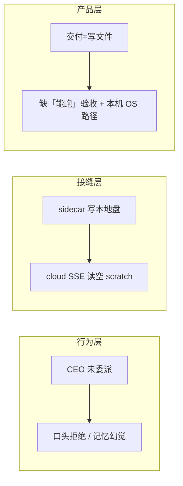

# 产品 AI 协作优化复盘

> **定位**：元讨论锚点——从真实对话日志提炼「基本能力缺失」与行业对标，分阶段落地。案例驱动，决策通过后将结论迁入 `01`–`05` 现状文档。

## 触发案例

| 键 | 值 |
|---|---|
| conversation_id | `f679e16e-d1a9-4446-8e29-cd51cd298a14` |
| 问题 trace | `d1bc76f3681c4a0f812acf8a6f43642f` |
| 用户诉求链 | 开发类 OpenClaw Agent → 帮我做到打开软件 → 你知道产出吗 → 直接打开软件 |

### 症状摘要

1. **首轮委派**写出 MiniClaw，但未跑通集成验收。
2. **续接回合** `file_list` 见空工作区（sidecar 写本地、云端回合读服务器 scratch——接缝）。
3. **回忆回合** tools=0 凭记忆回答「知道，在 mini-claw/」。
4. **打开软件** tools=0 口头拒绝「没法运行终端」，给用户 bash 复制块。

### 与产品叙事的矛盾

用户要的是 OpenClaw 式「电脑操作员」；产品先解释 OpenClaw 能在用户电脑上执行任务，交付代码后却说「你自己在终端跑」。

---

## 根因（三层）



| 层 | 问题 | 状态 |
|---|---|---|
| **行为** | 执行类 / 回忆类请求未走路由铁律 | ✅ Phase 0 prompt 已补（`resolve/prompt.py` `_CEO_CORE_HINT`） |
| **接缝** | `local_container_root_id` 未参与 cloud 回合 backend 解析 | ✅ 已修（`conversation/common.py` `resolve_local_binding`） |
| **产品** | 双路径执行（工作区内跑通 + 本机 OS 启动）未产品化 | ⏳ Phase 1–2 |

---

## 决策（2026-07-09）

1. **Phase 0 与接缝修复并行都做**——不等用户再踩坑。
2. **「打开软件」双路径都要**——按工作区类型自动分流，不是二选一：
   - **路径 A · 工作区内验收**：worker `code_execute` / `test_run` 在绑定工作区（含 sidecar 本地盘）跑通。
   - **路径 B · 本机 OS**：桌面 Client Tools / 终端一键运行（远期）；短期 `ask_user` 引导绑定 + 委派验收。
3. **本稿作规划锚点**——落地结论逐步迁入 [编排器与CEO主Agent](/docs/03-AI核心/编排器与CEO主Agent.md)、[双模式工作区](/docs/02-架构/双模式工作区.md)。

---

## 分阶段方案

### Phase 0 · 行为修正（已落地）

| 项 | 做法 |
|---|---|
| 执行类路由 | 「安装 / 运行 / 打开」→ 必须 `delegate` + 验收条件；禁止口头推命令给用户 |
| 回忆类路由 | 「刚才产出」→ 必须先 `file_list` / `file_read` |
| 拒绝话术 | 不说「没有权限」；改引导绑定 / 委派 |
| 接缝 | `local_root_id \|\| local_container_root_id` → cloud 回合同一本地 backend |

**验收**：eval / 日志断言——用户说「帮我打开刚写的软件」→ CEO 调用 `delegate` 或 `ask_user`，非 tools=0 拒绝。

### Phase 1 · 交付闭环（⏳ 2–4 周）

| 项 | 做法 |
|---|---|
| 委派验收契约 | `completion_criteria=code_verified` 常态化；task 含运行/打开语义时引擎**自动推断**；集成任务 task 写「进程启动成功」 | ✅ |
| 工作区空检测 | 侧栏空树文案 + CEO 空工作区 `<workspace_file_index>` 引导 | ✅ 已落地 |
| eval 向量 | `routing/delegate_run_app` + `core/tool_use_recall_prior_output` | ✅ 已落地 |
| 代码块「在终端运行」 | 桌面 Chat bash 块 **在终端运行**（Electron 确认后 spawn） | ✅ 已落地 |
| 产物导出 | 侧栏工作区 **导出 ZIP**（快照 + 下载） | ✅ 已落地 |

### Phase 2 · 本机操作员（部分落地）

| 项 | 做法 | 状态 |
|---|---|---|
| `completion_criteria` 教学 | `team_orchestration_advanced` 补充 code_verified vs files_written | ✅ |
| 环境感知 | `project_profile.run_commands`（package.json start/dev、pyproject scripts） | ✅ |
| Client Tools | 侧栏「打开文件夹 / 在终端打开」+ 聊天 bash「在终端运行」+ 输入区「本机快捷操作」卡；Agent 经 `workspace_op.execute` | ✅ 最小集 |
| 自动验证 | 委派收尾：显式或 task 推断 `code_verified`，校验 `code_execute` / `test_run` | ✅ |

### Eval 真跑（2026-07-09，二次重试仍 502）

`routing_delegate_run_app` / `tool_use_recall_prior_output` 已提交用例；真跑时 platform LLM **仍返回 502**（6/6 routing 用例 `finish_reason=error`，无法观测 CEO 路由行为）。待 proxy 恢复后重跑：

```bash
cd apps/server
uv run python -m agentcore.evals --routing --layer 1
uv run python -m agentcore.evals --suite core --layer 1  # 含 tool_use_recall_prior_output
```

### Phase 2+ · OS 通知（部分落地）

| 项 | 做法 | 状态 |
|---|---|---|
| 窗口失焦原生通知 | 跨对话完成/审批：toast + Electron `Notification`（点击跳转对话） | ✅ |
| Agent 触发任意 OS 通知 | worker `desktop_notify` 工具 + GRANTABLE 审批 + client_tool 通道 | ✅ |

---

## 行业对标

| 产品 | 用户心智 | AgentCore 差距 |
|---|---|---|
| Cursor / Windsurf | Agent 可跑终端（需确认） | CEO 直拒；应委派 worker |
| Claude Code | 本地仓库内执行 | sidecar 有，但 cloud 回落丢文件 |
| OpenClaw | 本机电脑操作员 | 缺 Client Tools + OS 级路径 |

**保留**：CEO 只读 + worker 执行的多 Agent 架构不变——改的是**路由**与**执行面一致性**，不是推翻协调者模型。

---

## 关联文档

- [编排器与CEO主Agent §协调者工具边界](/docs/03-AI核心/编排器与CEO主Agent.md)
- [双模式工作区 §十 sidecar](/docs/02-架构/双模式工作区.md)
- [对话日志分析指南](/docs/05-平台与运维/对话日志分析指南.md)
- [远期规划 §一 完全离线](/docs/06-规划/远期规划.md)
