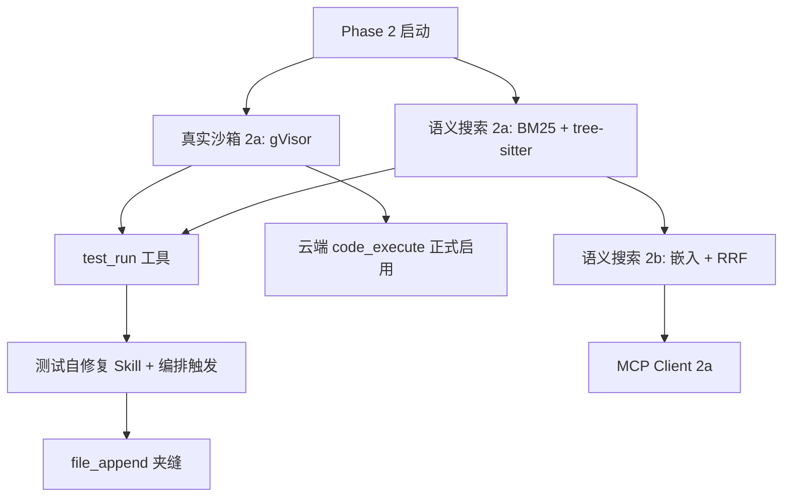

# 代码能力增强 Phase 2 规划 🗂️

> **定位**：Phase 2 三大方向（语义搜索 / 更强沙箱 / 测试修复循环）+ 优先级与风险分析。落地前需人确认。
>
> **治理**：本目录仅 `07-规划`；🗂️ = 讨论中、未承诺落地。决策通过、开始落地后迁入 [工具与能力系统](/docs/03-AI核心/工具与能力系统.md) 与 [安全权限与治理](/docs/05-平台与运维/安全权限与治理.md) §五，本条退役。
>
> **背景**：Phase 1 已落地（现状见 [工具与能力系统](/docs/03-AI核心/工具与能力系统.md)）——`file_read` 行号范围、`file_list` 递归树、项目感知注入、`git` 工具、`code_execute` 流式输出。

---

## 一、行业实践参考

### 1.1 语义代码搜索

2026 年主流实现已收敛为 **「结构化分块 + 混合检索 + Agent 工具化」**，而非把整库向量塞进 prompt。

| 实践 | 要点 |
|------|------|
| **分块策略** | 普遍用 [tree-sitter](https://tree-sitter.github.io/) 按函数/类/方法边界切分，而非任意 token 块（[Semble](https://github.com/minishlab/semble)、[qex-mcp](https://lib.rs/crates/qex-mcp)、[semhood](https://github.com/AhmeedGamil/semhood)） |
| **混合检索** | 稠密向量（语义）+ BM25/FTS（标识符精确匹配）并行查询，用 **Reciprocal Rank Fusion (RRF, k=60)** 融合；业界报告混合比纯向量召回高约 48%（[qex-mcp](https://lib.rs/crates/qex-mcp)） |
| **嵌入模型** | 本地 CPU 路线：Model2Vec 静态嵌入（[potion-code-16M](https://huggingface.co/minishlab/potion-code-16M)，无 GPU、毫秒级查询）；云端路线：OpenAI / Voyage / Jina Code V2 等 code-specialized 模型 |
| **索引存储** | 轻量本地：SQLite + FTS5 / tantivy + sqlite-vec；规模更大：Qdrant / Milvus；增量更新普遍用 Merkle DAG 或文件 hash 变更检测（[qex-mcp](https://lib.rs/crates/qex-mcp)） |
| **Agent 集成形态** | 几乎都以 **MCP server** 或内置 `search_code` 工具暴露——Agent 按需调用，返回 chunk + 行号 + 可选调用图上下文（[semhood](https://github.com/AhmeedGamil/semhood) 的 `get_chunk_context`） |
| **Cursor Context Engine** | tree-sitter 分块 + Merkle 树 ~3–5 分钟同步变更 + Turbopuffer 向量索引 + 依赖图辅助 |

**增量更新模式**：文件变更 → hash/Merkle 比对 → 仅重索引变更文件的受影响 chunk；全量重建作为冷启动或 corruption 恢复路径。

### 1.2 沙箱隔离方案

2026 年行业共识：**不可信 / LLM 生成代码不能用标准 Docker（共享宿主机内核）作为唯一边界**（[Zylos Research](https://zylos.ai/research/2026-04-04-ai-agent-sandboxing-security-isolation/)、[Northflank](https://northflank.com/blog/how-to-sandbox-ai-agents)）。

| 方案 | 隔离机制 | 启动速度 | 安全强度 | 典型用途 |
|------|----------|----------|----------|----------|
| **Docker + seccomp** | 命名空间 + cgroup + seccomp | 毫秒级 | 弱（共享内核） | 仅可信内部自动化 |
| **gVisor (runsc)** | 用户态 Sentry 拦截 syscall | ~100ms | 强（syscall 不直达宿主机） | 多租户 SaaS、I/O 适中工作负载 |
| **Firecracker microVM** | KVM 硬件虚拟化、独立内核 | ~125ms | 最强 | AWS Lambda、E2B、不可信代码 |
| **Kata Containers** | 每 Pod 一个 microVM | ~200ms | 最强 | K8s 上多租户 Agent |
| **Nsjail** | namespace + seccomp + rlimit | 快 | 中 | CTF / 竞赛级隔离，运维面窄 |
| **托管沙箱（E2B / Modal / Fly Machines）** | 底层 Firecracker 或 gVisor | <1s（冷启动） | 强 | 快速接入、免自建运维 |

**Cursor Cloud Agents**（原 Background Agents）：每任务一台**隔离 Linux VM**（完整开发环境：repo clone、依赖、密钥、网络策略）；进阶路径支持自托管 worker pool，Agent loop 仍在 Cursor 云端、tool 执行在用户机器（[Cursor Cloud Agents 文档](https://cursor.com/docs/cloud-agent)、[架构分析](https://cozypet.github.io/cursor-cloud-harness/)）。本地 Agent 与 Cloud Agent 分层：本地用 worktree 隔离并行会话，云端用 VM/Docker 容器隔离（[Agent Safehouse 调查报告](https://agent-safehouse.dev/docs/agent-investigations/cursor-agent)）。

**Kubernetes 生态**：`kubernetes-sigs/agent-sandbox` 控制器将 workload 生命周期与隔离后端解耦，同一 `SandboxTemplate` 可指向 gVisor / Kata / 标准容器（[Northflank K8s 沙箱指南](https://northflank.com/blog/sandboxes-on-kubernetes)）——与 AgentCore 远期「API 不碰 Docker、执行经 NATS 转发到 worker」方向一致（见 [`远期规划.md` §2.1](/docs/07-规划/远期规划.md)）。

### 1.3 自动测试 + 修复循环

行业实现分三层：

| 层级 | 代表 | 做法 |
|------|------|------|
| **产品内置** | Cursor Cloud Agents | PR 创建后自动尝试修复 GitHub Actions CI 失败；单 PR 最多 **10 次** autofix follow-up；可用 `@cursor autofix off` 关闭（[Cursor Capabilities](https://cursor.com/docs/cloud-agent/capabilities)） |
| **用户编排** | Cursor `/loop` | 目标驱动循环，如 `until tests pass`；**必须**设 `--max-turns` / `--max-runtime` 防成本失控（[Cursor 3.5 /loop 分析](https://www.meritforgeai.com/ai-coding/cursor-3-5-loop-scheduled-agents-may-2026/)） |
| **脚本 / Hook** | Cursor CLI + bash | `while` 循环：跑测试 → 失败则把 stderr 喂给 `cursor agent` → 重试；常见 `MAX_LOOPS=10`（[BenXHub 无限调试循环](https://benxhub.com/en/blog/cursor/cli/07-unlimit-loop-debug)） |
| **学术 / 框架** | TDFlow、LLMloop | 专用子 Agent 分工（提议 patch / 调试单测 / 修订）；LLMloop 五轮循环（编译错误 → 静态分析 → 测试失败 → 变异测试）；testpilot-ai 默认 **3 轮** verify-fix（[TDFlow EACL 2026](https://aclanthology.org/2026.eacl-long.70/)、[LLMloop](https://www.arxiv.org/pdf/2603.23613)） |

**共性模式**：
1. 测试命令 exit code 为唯一权威通过信号
2. 失败时只回传**失败增量**（stack trace / 末 30 行），不全量重发
3. 硬上限轮次（3–10 次）+ 振荡检测（同失败签名重复 → 放弃）
4. 修不好时 escalate 给人或标 `degraded` 交付

**放弃策略**：达 max iterations、同错误签名连续 N 次、测试文件本身被 agent 改坏（应禁止）、或成本/时间预算耗尽。

### 1.4 MCP 生态现状

MCP 已成为 AI Agent 接入外部工具的事实标准（[Anthropic MCP 文档](https://github.com/modelcontextprotocol/docs)）。

**2026-07-28 规范 RC**（预定 2026-07-28 正式发布）是迄今最大修订（[MCP 官方博客](https://blog.modelcontextprotocol.io/posts/2026-07-28-release-candidate/)）：

| 变更 | 影响 |
|------|------|
| **无状态核心** | 移除 initialize 握手与 `Mcp-Session-Id`；每请求携带 `_meta`（协议版本 + 能力） |
| **HTTP 路由头** | 强制 `Mcp-Method` + `Mcp-Name`，负载均衡可不解析 JSON body |
| **缓存元数据** | `tools/list` 等返回 `ttlMs` + `cacheScope` |
| **扩展框架** | MCP Apps（服务端渲染 UI）、Tasks（长任务轮询）拆为官方扩展 |
| **MRTR** | 工具可返回 `InputRequiredResult` 中途向用户追问，客户端带 `inputResponses` 重试 |
| **SDK** | Python v2 / TypeScript v2 Beta；TS 拆包为 `@modelcontextprotocol/server` 等 |

**成熟 MCP Server 示例**（与代码能力相关）：
- **GitHub MCP** — PR/Issue 操作（Codex 官方示例）
- **Semble / qex-mcp / semhood** — 语义代码搜索
- **数据库 / Slack / Linear** — 企业集成

**接入成本**：stdio 传输最简单（子进程）；远程 HTTP 需处理 OAuth 2.1 授权（RC 强化）、无状态路由、工具列表缓存。对 AgentCore：需在 `ToolRegistry` 层增加 MCP 适配器，审批 / 超时 / 输出截断与内置工具对齐。

### 1.5 关键启示

对 AgentCore 的适用性分析：

1. **语义搜索应走「工具化混合检索」，而非推翻 agentic 路线**——行业同样把搜索做成 Agent 按需调用的工具/MCP，而非自动向量注入 prompt；与 [`Agent记忆与知识系统.md` §5.6](/docs/03-AI核心/Agent记忆与知识系统.md)「否决纯向量 RAG、概览 + agentic 检索」**兼容**。
2. **沙箱分阶段**：单机 compose 先 gVisor（不挑硬件）；多租户 / 云端放开不可信执行时再上 Firecracker + 独立 worker（与远期规划 §2.1 一致）。
3. **测试自修复优先编排层 + 现有 ReAct**，不必新建子系统——Cursor 的 `/loop` 与 Cloud Agent CI autofix 都是「在已有 Agent 循环外套约束」，不是新工具类型。
4. **MCP 是生态位扩展，不是代码能力核心**——产品定位是协作智能平台而非 IDE（[`产品定位与品牌.md`](/docs/01-产品/产品定位与品牌.md)）；MCP 宜晚于沙箱与搜索，先接高价值 server（GitHub、语义搜索互补）。
5. **长文分段 + `file_append` 与测试循环正交**——远期已决暂缓（[`远期规划.md` §三](/docs/07-规划/远期规划.md)）；若做，宜与 worker 写作任务绑定，优先级低于三者。

---

## 二、Phase 2 方向一：语义代码搜索

### 2.1 设计目标

- 用户 / AI 能用自然语言描述意图搜索代码（如「处理用户认证的 middleware」）
- 补充 `grep` 无法覆盖的场景：概念搜索、近义词、跨文件关联、「做什么」而非「叫什么」
- **不**改变常驻 prompt 注入策略——搜索结果经工具返回，由 Agent 决定是否 `file_read`

### 2.2 方案对比

| 方案 | 优点 | 缺点 | 适合度 |
|------|------|------|--------|
| **本地嵌入索引 + 向量检索** | 语义召回强；可离线；chunk 级省 token | 需 embedder + 索引存储；文件变更需增量维护；标识符精确匹配弱 | ★★★★ 作混合检索的一半 |
| **tree-sitter + 符号/依赖图** | 结构精确；调用关系可附上下文；无嵌入成本 | 无语义近义；需维护多语言 grammar | ★★★★ 作混合检索的另一半 |
| **LLM 驱动搜索（多步 grep）** | 零新基建；与现路线一致 | 大仓库慢、烧 token；无稳定召回 | ★★★ 已是 today 默认，不够 |
| **混合方案（BM25 + 向量 + RRF + tree-sitter 分块）** | 行业最佳实践；grep 与语义互补；工具化不污染 prompt | 实现复杂度中等；需索引生命周期管理 | ★★★★★ **推荐** |
| **纯向量 RAG 注入 prompt** | 实现简单 | 与已决「agentic 检索」冲突；一改文件就 stale；烧 prefix 缓存 | ✗ **否决**（沿用 §5.6 决策） |

### 2.3 推荐方案

**推荐：混合检索工具 `code_search`（增强 agentic 路线，非推翻）**

理由：
1. 与 [`Agent记忆与知识系统.md` §5.6](/docs/03-AI核心/Agent记忆与知识系统.md) 一致——**索引是工具的后端，不是 prompt 的自动 RAG 层**；CEO/worker 按需调用，结果进 tool result（可截断、可 `file_read` 跟进）。
2. 行业 2026 共识即 hybrid（BM25 + dense + RRF），纯向量或纯 grep 均非最优。
3. Phase 1 已有 `grep` + `file_read` offset/limit + `project_profile`——`code_search` 定位「意图找入口」，找到后再用现有工具精读。

**分阶段实现**：
- **2a（P1）**：tree-sitter 分块 + BM25（SQLite FTS5 或 tantivy）+ Merkle/hash 增量索引；**无嵌入**，已覆盖「找符号 + 轻语义关键词」
- **2b（P2）**：加本地静态嵌入（Model2Vec / potion-code-16M 类）或可选云端 embedder；RRF 融合
- **2c（可选）**：调用图 `get_chunk_context`（谁调用谁）——semhood 证明可显著减少后续 `file_read` 次数

**触发条件对齐**：[`上下文注入统一性讨论`](/docs/07-规划/上下文注入统一性讨论.md) 扳机 A——工作区涨到数百文件且 dogfood 显示 `grep` 召回不足时再上 2b；2a 可在更小仓库先行验证管线。

### 2.4 接口设计（草案）

**新工具 `code_search`**（worker + CEO 只读子集）：

```python
# apps/server/agentcore/tools/builtin/code_search.py（新文件，草案）

parameters = {
    "type": "object",
    "properties": {
        "query": {
            "type": "string",
            "description": "自然语言或关键词查询，描述要找的代码意图。",
        },
        "language": {
            "type": "string",
            "description": "可选，过滤语言：python / typescript / ...",
        },
        "path_prefix": {
            "type": "string",
            "description": "可选，限制搜索子目录（工作区相对路径）。",
        },
        "max_results": {
            "type": "integer",
            "default": 10,
            "maximum": 30,
        },
        "include_context": {
            "type": "boolean",
            "default": False,
            "description": "是否附带调用方/被调方摘要（2c）。",
        },
    },
    "required": ["query"],
}
```

**输出格式**（对齐 `grep` / `file_read` 行号习惯）：

```
apps/server/agentcore/runtime/approvals.py:42-78  ApprovalGate.check (python)
  async def check(self, tool_name: str, ...) -> ApprovalResult:
  score=0.87  match=hybrid

apps/server/agentcore/tools/protocol.py:15-28  ToolApproval (python)
  class ToolApproval(StrEnum): ...
  score=0.72  match=bm25

（共 2 条，用 file_read path offset/limit 查看全文）
```

**`WorkspaceBackend` 扩展**（索引侧，非每次工具调用走远程）：

```python
# workspace/protocol.py 扩展（草案）

@dataclass(frozen=True)
class CodeChunk:
    path: str
    symbol: str | None
    symbol_type: str | None  # function / class / method
    start_line: int
    end_line: int
    language: str
    snippet: str  # 首行预览，非全文

@dataclass
class CodeSearchResult:
    chunks: list[CodeChunk]
    scores: list[float]
    index_stale: bool  # True 时提示 Agent 可 fallback grep

async def code_search(
    self,
    query: str,
    *,
    language: str | None = None,
    path_prefix: str = ".",
    max_results: int = 10,
) -> CodeSearchResult: ...

async def ensure_code_index(self, *, force: bool = False) -> IndexStatus: ...
```

**索引存储位置**：
- 本地 / sidecar 模式：工作区旁 `.agentcore/index/`（gitignore）
- 云端 `ServerWorkspace`：按 `folder_id` 隔离的索引目录或 Postgres + pgvector（仅当 2b 且多租户共享时需要）

**与 `grep` 关系**：并存，不替代——`grep` 保留精确正则；`code_search` 负责意图。`investigation_tools` 白名单同时收录二者（参与 `tool_clear`）。

### 2.5 实现复杂度与依赖

| 项 | 估时 | 依赖 |
|----|------|------|
| tree-sitter 多语言 grammar + 分块 | 中 | `tree-sitter` Python binding；覆盖 Python / TS / TSX 优先（与 monorepo 对齐） |
| BM25 索引 + 增量 hash | 中 | SQLite FTS5（零新服务）或 tantivy（Rust 侧car 可选） |
| `code_search` 工具 + backend 接线 | 小 | `WorkspaceBackend` 双实现（`LocalWorkspace` / `ServerWorkspace`） |
| 静态嵌入 + RRF（2b） | 中 | `model2vec` 或 ONNX Runtime；可选 GPU-less |
| 调用图（2c） | 大 | 需 per-language tree-sitter query + 跨文件解析 |

**新依赖评估**：tree-sitter 为可接受的新依赖（行业标配）；pgvector **非 Phase 2 必须**（2a 不需要）。

---

## 三、Phase 2 方向二：真实沙箱

### 3.1 设计目标

- 云端 `code_execute` 可安全启用（今日 `CODE_EXECUTE_CLOUD_ENABLED` 需 `CODE_EXECUTE_CLOUD_UNSAFE_ACK` 明示风险——见 `main.py`）
- 资源隔离：CPU / 内存 / 网络 / 磁盘 / pids
- 进程逃逸防护：不可信代码不共享 API 容器内核
- 与本地 sidecar 模式一致接口——`SandboxProvider` 第二实现

### 3.2 方案对比

| 方案 | 安全性 | 启动速度 | 运维复杂度 | 成本 |
|------|--------|----------|------------|------|
| **gVisor (runsc)** | 强 | ~100ms | 中（需 runsc runtime） | 低（无 KVM 要求） |
| **Firecracker microVM** | 最强 | ~125ms | 高（需 KVM、镜像管理） | 中 |
| **Docker + seccomp** | 弱 | 毫秒级 | 低 | 最低 |
| **Nsjail** | 中 | 快 | 中（偏安全竞赛场景） | 低 |
| **E2B / Modal 托管** | 强 | <1s 冷启动 | 最低 | 按量付费、供应商锁定 |
| **Kata + NATS worker** | 最强 | ~200ms | 高（独立 worker 池） | 中高 |

### 3.3 推荐方案

**推荐：两阶段，与 [`远期规划.md` §2.1](/docs/07-规划/远期规划.md) 对齐**

| 阶段 | 部署形态 | 方案 | 理由 |
|------|----------|------|------|
| **Phase 2a** | 单机 compose / 单节点 | **gVisor (`runsc`)** 作为 `SandboxProvider` 第二实现 | 不挑 KVM；与现有 Docker Compose 栈兼容；安全强度足够挡 LLM 生成代码；远期文档已标为 Post-MVP 升级目标 |
| **Phase 2b** | 多节点 / 多租户 | **Firecracker（或 Kata）+ 独立 Worker + NATS** | API 容器永不执行用户代码；与「API 不碰 Docker」目标一致；需 KVM 机器 |

**不推荐 Phase 2 直接上托管沙箱（E2B/Modal）作为主路径**：与「自建、可控、BYOK/隐私」产品方向冲突；可作为**加速选项**供企业租户选用（远期）。

**本地 / sidecar**：`SubprocessSandbox` **保留**——用户本机执行可信代码、已有 OS 级隔离；云端才强制 gVisor。

### 3.4 SandboxProvider 接口演进

**现有协议**（[`核心接口定义.md` §三](/docs/02-架构/核心接口定义.md)、`tools/sandbox/protocol.py`）：

```python
class SandboxProvider(Protocol):
    async def execute(self, request: ExecutionRequest) -> ExecutionResult: ...
    async def health_check(self) -> bool: ...
```

**Phase 2 扩展（向后兼容）**：

```python
@dataclass
class ExecutionRequest:
    # ... 现有字段 ...
    env: dict[str, str] | None = None       # 白名单注入
    network_mode: Literal["none", "restricted"] = "none"
    cpu_limit: float = 1.0                  # 核数
    pids_limit: int = 128

@dataclass
class SandboxCapabilities:
    isolation: Literal["subprocess", "gvisor", "microvm"]
    supports_network: bool
    max_memory_mb: int
    max_timeout_seconds: int

class SandboxProvider(Protocol):
    async def execute(self, request: ExecutionRequest) -> ExecutionResult: ...
    async def health_check(self) -> bool: ...
    def capabilities(self) -> SandboxCapabilities: ...  # 新增，有默认实现
```

**工厂选择**（`workspace/locate.py` 已有注入点）：

```
location=local / sidecar  → SubprocessSandbox（不变）
location=server + GVISOR_ENABLED  → GVisorSandbox
location=server + FIRECRACKER_ENABLED  → FirecrackerSandbox（2b）
```

**向后兼容**：`capabilities()` 默认返回 `subprocess`；`code_execute` 工具 schema 不变；仅 `ExecutionRequest` 新字段有默认值。

### 3.5 资源限额设计

与远期规划 §2.1 锁死项对齐：

| 维度 | 默认值 | 说明 |
|------|--------|------|
| 内存 | 256 MB | 对齐现有 `ExecutionRequest.memory_limit_mb` |
| CPU | 1 核 | gVisor cgroup |
| 执行时间 | 90s | 对齐 `code_execute` schema；可配置上限 |
| pids | 128 | 防 fork 炸弹 |
| 网络 | **默认禁** | `network_mode=none`；白名单域名需显式开启 + 审批 |
| 磁盘 | 只读根 + tmpfs 工作区 | 工作区挂载 copy-on-write 或同步快照 |
| 并发 | 2 / 租户 | 防资源耗尽；队列化超出部分 |

流式输出（Phase 1 `on_output`）**原样保留**——gVisor 内进程 stdout 仍经分块回调。

### 3.6 实现复杂度与依赖

| 项 | 估时 | 依赖 |
|----|------|------|
| gVisor runsc 镜像 + POC | 中 | 宿主机安装 runsc；CI 需嵌套虚拟化或专用 runner |
| `GVisorSandbox` 实现 | 中 | `asyncio` 子进程调 `runsc run`；工作区 bind mount |
| 资源限额 + 网络策略 | 中 | cgroup v2；iptables / gVisor netstack |
| 工厂 + 配置门控 | 小 | 替换 `CODE_EXECUTE_CLOUD_UNSAFE_ACK` 为 capability 检测 |
| Firecracker worker（2b） | 大 | KVM、microVM 镜像流水线、NATS request/reply |
| 审批策略 | 小 | 云端 gVisor 启用后 `code_execute` 可维持 `GRANTABLE` per-call |

---

## 四、Phase 2 方向三：测试运行 + 自修复循环

### 4.1 设计目标

- AI 写完代码后**自动**运行相关测试（非仅用户手动要求）
- 测试失败时解析错误输出并尝试修复
- **有限重试**，防无限循环与成本失控
- 失败时透明汇报（含测试日志摘要），而非静默放弃

### 4.2 行业实践总结

| 产品 / 框架 | 策略 | 轮次上限 |
|-------------|------|----------|
| Cursor Cloud Agent | PR 上自动修复 GitHub Actions 失败 | **10 次** / PR |
| Cursor `/loop` | 用户声明 `until tests pass` | 用户设 `--max-turns`（建议 20–50） |
| testpilot-ai | generate → run → fix | 默认 **3** |
| TDFlow | 子 Agent 分工 debug 单测 | 算法循环直至通过或预算耗尽 |
| AgentCore 现有 `LoopController` | 同工具同方式失败 **3** 次停用；A-B 振荡 **3** 轮 NUDGE→FINALIZE | 可复用 |

### 4.3 推荐方案

**推荐：编排层 Skill + 轻量工具增强，非新引擎子系统**

| 组件 | 形态 | 说明 |
|------|------|------|
| **`test_run` 工具**（或扩展 `code_execute`） | 新工具 | 结构化跑测试命令；解析框架输出（pytest / vitest / jest）；返回 `{passed, failed, failures[]}` JSON + 人类可读摘要 |
| **`verify_and_fix` Skill**（可选） | Skill 文档 | 指导 worker：改代码 → `test_run` → 失败则读相关文件 → 修 → 重试；写入 `skills/` 市场 |
| **编排层触发** | CEO `delegate` 约束 | 任务含「实现 X」时 `delegate` 附 `acceptance: "相关测试通过"`；worker system hint 注入测试命令（来自 `ProjectProfile.test_commands`） |
| **引擎收敛复用** | 现有 `LoopController` | 同失败签名 3 次 → 停用 `test_run` 并 NUDGE；不新建熔断器 |

**不推荐**单独建「TestFixAgent」子系统——与 TDFlow 学术方案相比，AgentCore 已有 ReAct + `revise` + `escalate`，叠加 Skill + 工具即可。

**`test_run` vs `code_execute`**：
- `code_execute`：通用脚本、构建、一次性命令；per-call 审批
- `test_run`：预置安全命令模板（`pytest`、`pnpm test`、`uv run pytest`）；只读沙箱内执行；`approval=NEVER` 若命令来自 `ProjectProfile` 白名单

### 4.4 与现有架构的关系

```
CEO delegate(task="实现 foo", acceptance="测试通过")
    → Worker ReAct
        → file_write / str_replace
        → test_run(scope="affected")     # 新工具
        → [失败] file_read + 修复
        → test_run（重试）
        → done + 简报含测试结果
    → CEO 收尾可引用 test_run 最后一次结果
```

**已有基础设施**：
- `code_execute` 流式 + 沙箱（Phase 2 沙箱强化后测试也在隔离环境跑）
- `ProjectProfile.test_commands`（Phase 1 已检测）
- `LoopController` 重复失败 / 振荡检测（§四）
- `escalate` kind=scope / kind=dep——测试搞不定时 worker 可上报
- `finish_guard` 轻层——不覆盖测试逻辑（远期 §2.5 重层审查仍暂缓）

**需新增**：
- 测试输出解析器（pytest / vitest 优先）
- `test_run` 工具 + 命令白名单
- Worker prompt 片段：「交付前必须 test_run 通过或 escalate」
- 可选：CEO `delegate` schema 增加 `run_tests: bool` 字段

### 4.5 退出策略

| 条件 | 行为 |
|------|------|
| `test_run` 通过 | 正常 `done` |
| 重试达 **3** 轮（可配置 `engine_test_fix_max_rounds`） | 注入 steer：「测试仍失败，在交付中如实列出失败用例与可能原因」→ 允许 `done` + `degraded` |
| 同失败签名连续 **2** 轮 | 提前放弃修复，防振荡（对齐 testpilot-ai） |
| 测试命令本身报错（非 assert） | 视为环境 problem → `escalate` kind=dep |
| 用户 `stop` | 现有取消传播 |

**是否 escalate CEO**：默认 worker 自包含；连续 3 轮失败后 `escalate` kind=scope 可选开启——CEO 决定砍范围或派第二 worker。

### 4.6 实现复杂度与依赖

| 项 | 估时 | 依赖 |
|----|------|------|
| `test_run` 工具 + pytest JSON 解析 | 小–中 | 依赖 Phase 2 沙箱（云端）或本地 subprocess |
| vitest / jest 解析 | 中 | 各框架 reporter 格式 |
| Skill + worker prompt 片段 | 小 | 无代码硬依赖 |
| `delegate` acceptance 字段 | 小 | 编排 schema 扩展 |
| 评测向量 | 小 | `conformance/vectors/` 增 test-fix 场景 |

**依赖关系**：测试循环在**云端**可靠运行依赖方向二（真实沙箱）；本地 sidecar 可先用 `SubprocessSandbox` 跑通逻辑。

---

## 五、补充项

### 5.1 file_append

**需求**：超长文档（论文、报告）分段写入——`file_write` 覆盖全文，`file_append` 在末尾追加，避免每次重写万行文件。

**设计草案**：
- 参数：`path`、`content`；可选 `create_if_missing`（默认 true）
- 审批：`GRANTABLE`（与 `file_write` 同门）
- 输出：`已追加 N 字符，文件共 M 行`
- 与长文分段写作：CEO 先出大纲 → worker 逐节 `file_append`（[`远期规划.md` §三](/docs/07-规划/远期规划.md) 已倾向此路线）

**优先级**：低——触发条件为「长文延迟成高频痛点」；实现复杂度小，可夹缝交付。

### 5.2 MCP 协议接入

**范围建议（Phase 2 瘦接入）**：

| 阶段 | 内容 |
|------|------|
| **2a** | MCP **Client** 适配层：`McpToolAdapter` 实现 `Tool` Protocol；stdio 传输；用户配置 `~/.agentcore/mcp.json` |
| **2b** | 首批官方模板：**GitHub**（PR/Issue）、**filesystem**（只读备用）；可选接入 semble 类搜索 MCP 作 `code_search` 替代实现 |
| **不做（Phase 2）** | MCP Server 角色（AgentCore 对外暴露为 MCP server）、MCP Apps UI、A2A |

**架构影响**：
- `ToolRegistry` 增加 `register_mcp_tools(session)` 动态加载
- 审批：`McpToolSchema` 映射 `ToolApproval`；默认 `GRANTABLE`
- 超时 / 输出截断与内置工具一致
- CEO 工具表膨胀 → 可借鉴 Claude Code `ToolSearch` 延迟加载（远期）

**与代码能力关系**：MCP 是**能力边界扩展**，不替代内置 `git` / `file_*` / `code_search`——内置工具保证离线、审批一致、conformance 可测。

---

## 六、优先级与排期建议

| 方向 | 用户价值 | 技术风险 | 实现复杂度 | 建议优先级 |
|------|----------|----------|------------|------------|
| 语义代码搜索 | 高（大仓库找代码效率） | 中（索引一致性） | 中 | **P1** |
| 真实沙箱 | 高（云端执行安全） | 高（运维 / KVM） | 高 | **P1**（云端） |
| 测试自修复 | 高（交付质量） | 中（无限循环 / 误修） | 中 | **P2** |
| file_append | 低–中（长文场景） | 低 | 小 | **P3** |
| MCP 接入 | 中（生态） | 中（协议演进 / 授权） | 中 | **P3** |

### 建议落地顺序



**分批建议**：

1. **Batch 1（4–6 周）**：gVisor 沙箱 POC + `GVisorSandbox`；`code_search` 2a（BM25 + tree-sitter）；云端 `code_execute` 门控切换
2. **Batch 2（3–4 周）**：`test_run` + pytest 解析；worker verify Skill；`ProjectProfile` 测试命令接线
3. **Batch 3（按需）**：语义搜索 2b 嵌入；Firecracker worker；MCP Client；`file_append`

**依赖说明**：测试自修复在云端依赖沙箱；语义搜索与沙箱可并行。MCP 与 `code_search` 2b 二选一先行即可（均扩展检索面）。

---

## 七、风险与开放问题

以下需人决策后方可开工：

### 7.1 语义搜索

| # | 问题 | 选项 |
|---|------|------|
| 1 | 是否同意「工具化混合检索」而非 prompt RAG？ | A) 同意（推荐） B) 坚持纯 grep 增强 C) 推翻 §5.6 做向量注入 |
| 2 | 2a 是否先不上嵌入？ | A) 是，BM25+结构先行 B) 一步到位 hybrid |
| 3 | 索引存哪？ | A) 工作区 `.agentcore/index` B) 服务端 per-folder 集中存储 |
| 4 | 与 sidecar 本地引擎：索引在桌面还是云？ | A) 各算各的（本地盘） B) 云统一索引 |

### 7.2 真实沙箱

| # | 问题 | 选项 |
|---|------|------|
| 5 | Phase 2 是否只上 gVisor，Firecracker 推迟？ | A) 是（推荐） B) 直接 Firecracker |
| 6 | 云端测试是否默认禁网？ | A) 默认禁（推荐） B) 允许 pip install |
| 7 | 本地 sidecar 是否也强制 gVisor？ | A) 否，保持 subprocess B) 统一 gVisor |
| 8 | 是否评估 E2B 作为企业选项？ | A) 远期 B) Phase 2 并行 POC |

### 7.3 测试自修复

| # | 问题 | 选项 |
|---|------|------|
| 9 | 默认 max 修复轮次？ | A) 3 B) 5 C) 用户可配 |
| 10 | 测试失败仍 `done` 还是强制 `escalate`？ | A) degraded done（推荐） B) 必须 escalate |
| 11 | 是否允许 agent 修改测试文件？ | A) 禁止（推荐） B) 允许需审批 |

### 7.4 MCP 与补充项

| # | 问题 | 选项 |
|---|------|------|
| 12 | MCP 与内置 `code_search` 优先级？ | A) 先做内置 B) 直接接 semble MCP C) 并行 |
| 13 | MCP 规范版本？ | A) 2025-11-25 稳定 B) 直接 2026-07-28 RC |
| 14 | `file_append` 是否纳入 Phase 2？ | A) 夹缝 B) 推迟到长文痛点确认 |

### 7.5 横切

| # | 问题 | 说明 |
|---|------|------|
| 15 | 评测门禁 | 暂无真实轨迹（开发期纪律）——新能力须补 `conformance/vectors/` 合成向量 + 探针，不宣称生产数据验证 |
| 16 | 多 Agent 场景 | 测试自修复在并行 worker 时是否串行「最后一人跑全量测试」？建议：各 worker 跑**受影响子集**，CEO 收尾前可选全量 gate |

---

**参考链接**

- [Semble — agent-oriented code search](https://github.com/minishlab/semble)
- [qex-mcp — Rust MCP semantic search](https://lib.rs/crates/qex-mcp)
- [semhood — AST-aware semantic search](https://github.com/AhmeedGamil/semhood)
- [Zylos — AI Agent Sandboxing 2026](https://zylos.ai/research/2026-04-04-ai-agent-sandboxing-security-isolation/)
- [Northflank — How to sandbox AI agents](https://northflank.com/blog/how-to-sandbox-ai-agents)
- [amux — AI Agent Sandboxing Compared](https://amux.io/guides/ai-agent-sandboxing/)
- [Cursor Cloud Agents](https://cursor.com/docs/cloud-agent)
- [Cursor — Fixing CI Failures](https://cursor.com/docs/cloud-agent/capabilities)
- [TDFlow — Agentic TDD (EACL 2026)](https://aclanthology.org/2026.eacl-long.70/)
- [MCP 2026-07-28 Release Candidate](https://blog.modelcontextprotocol.io/posts/2026-07-28-release-candidate/)
- [远期规划 §2.1 真实沙箱](/docs/07-规划/远期规划.md)
- [Agent 记忆系统 §5.6 agentic 检索](/docs/03-AI核心/Agent记忆与知识系统.md)
