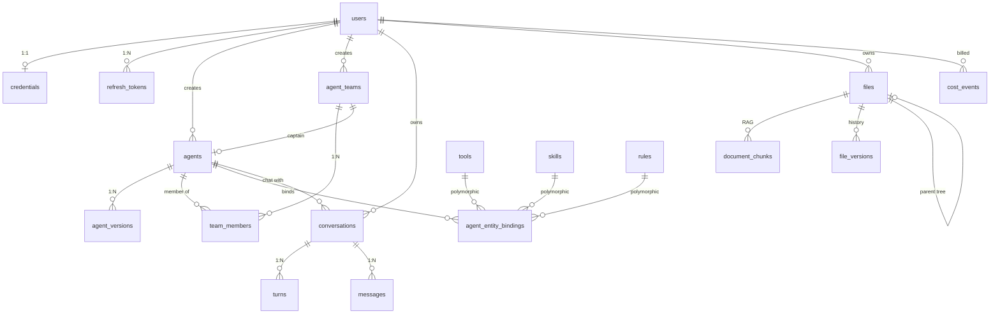

# 核心接口与数据模型定义

> **状态**：设计稿（已实现部分以代码为真相源）
> **目的**：定义模块间接口协议与核心数据类型，作为并行开发的契约。已落地的接口/模型只留「→ 见代码」指针 + 设计理由，避免与实现漂移；未实现的（如 §五 认证）保留完整契约。

---

## 总览

本文档定义 AgentCore 的核心接口和数据模型。各模块依据这些接口独立开发，通过抽象协议耦合而非具体实现耦合。

### 模块依赖图

```
用户 ↔ [Electron 前端] ↔ [API 层 (FastAPI)] ↔ [编排器]
                                              ↔ [执行引擎] ↔ [Agent 运行时]
                                                           ↔ [工具系统]
                                                           ↔ [LLM Provider]
                                              ↔ [记忆系统]
                                              ↔ [存储层]
```

### 接口分类

| 类别 | 文档章节 | 说明 |
|------|---------|------|
| LLM 抽象层 | §一 | Agent 和编排器调用 LLM 的统一接口 |
| 工具系统 | §二 | Agent 调用工具的协议 |
| 沙箱执行 | §三 | 代码执行隔离 |
| API 层 | §四 | 前端↔后端 REST + SSE |
| 认证 API | §五 | 注册/登录/刷新/登出 Cookie 会话 |
| 数据库模型 | §六 | PostgreSQL 持久化 Schema |
| 前端状态 | §七 | Zustand Store 类型定义 |

> 编排器输入/输出、执行引擎内部数据结构、TaskWorkspace 已在各自文档中详细定义，本文不重复。交叉引用见各节末尾。

---

## 一、LLM Provider 抽象层

### 1.1 核心协议

LLMProvider 是 LLM 调用的统一抽象（`complete` 非流式 / `stream` 流式），MVP 只实现 DeepSeekProvider。请求/响应/流式 chunk/Token 用量等数据类型与 Protocol 已落地：

→ 见代码：`apps/server/agentcore/llm/protocol.py`（`LLMProvider` / `LLMMessage` / `LLMRequest` / `LLMResponse` / `LLMChunk` / `TokenUsage` / `ToolCall` / `ToolCallDelta`）、`core/types.py`（`ModelTier`）

设计约束（代码看不出来的部分）：
- `ModelTier`（fast/strong）是**编排器对外输出的受控词汇**（worker 能力档位），本身不是模型名；运行时经 `agent_profile()` 映射到内部 `ModelProfile`——解耦「编排器输出契约」与「内部模型实现配置」。
- 思考模式由 `thinking` + `reasoning_effort` 控制；DeepSeek 思考模式下 tool call 必须回传 `reasoning_content`。

### 1.2 模型档位配置（ModelProfile）

单一事实源：每个用 LLM 的场景（orchestrator / chat / agent.fast·strong / synthesizer / memory / title）都是一个命名 `ModelProfile`，捆绑「模型 + 采样参数 + ReAct 轮次预算 `max_rounds`」。调用点只解析 profile，再用 `build_request()` 摊进 `LLMRequest`，不在各处手抄模型参数。

→ 见代码：`apps/server/agentcore/llm/config.py`（`PROFILES` / `get_profile` / `agent_profile` / `build_request`）

设计约束：
- profile 是**内部实现**，不暴露给编排器 LLM；编排器只产出 `ModelTier`，经 `agent_profile(tier)` 单点映射到 `agent.<tier>` profile。
- `max_rounds` 仅 ReAct 路径（`engine.react_loop`）消费；一次性 `complete` 的场景取默认。

模型分配策略（编排器 flash 思考 max、worker 按档位 fast 非思考/strong 思考、强档用 pro）见 [`技术架构与基础设施.md` §二](技术架构与基础设施.md) 与 `.cursor/rules/llm.mdc`。

### 1.3 与其他模块的关系

| 调用方 | 用途 | 典型配置 |
|--------|------|---------|
| 编排器 | 生成计划、检查点审视 | thinking (max), low temperature |
| Agent 运行时 | 执行任务步骤 | fast/strong, reasoning mode |
| 记忆系统 | 生成会话标题、维护记忆文件（ops） | fast, non-reasoning |
| 输出汇总器 | 合并多 Agent 结果 | synthesizer |

---

## 二、工具系统

### 2.1 工具协议

Tool 统一协议（`schema` 元信息 + `execute` 执行）、工具调用/结果/上下文/审批三态等数据类型已落地：

→ 见代码：`apps/server/agentcore/tools/protocol.py`（`Tool` / `ToolSchema` / `ToolResult` / `ToolContext` / `tool_schema_to_openai_format`）、`core/types.py`（`ToolCategory` / `ToolApproval`）；流式工具调用增量 `ToolCallDelta` 见 `llm/protocol.py`

设计约束：
- **审批三态** `never / grantable / always`：审批门与工具来源无关，内置/市场/连接器工具在执行层只认 `ToolBinding.approval` 一个字段（详见 [`执行引擎架构设计.md` §十五](执行引擎架构设计.md)）。
- `ToolResult.output` 超长由 `__post_init__` 自动截断，避免污染上下文窗口。

### 2.2 MVP 内置工具

内置工具实现见 `apps/server/agentcore/tools/builtin/`（`web_search`（经自建 SearXNG）/ `read_url`（网页正文抓取）/ `file_ops` / `code_execute`）。联网工具实现见 `tools/builtin/web/`（`search` + `read_url` + `_net` 出网韧性）。「分类即工具包、全部 opt-in」的装配策略见 [`执行引擎架构设计.md` §十五](执行引擎架构设计.md)。

### 2.3 工具注册表

ToolRegistry 负责工具注册/查询，并按编排器分配的工具名列表返回 ToolSchema（供 LLM function calling）：

→ 见代码：`apps/server/agentcore/tools/registry.py`

---

## 三、沙箱执行（SandboxProvider）

### 3.1 协议定义

SandboxProvider 统一抽象（`execute` + `health_check`）与执行请求/结果数据类型已落地：

→ 见代码：`apps/server/agentcore/tools/sandbox/protocol.py`（`SandboxProvider` / `ExecutionRequest` / `ExecutionResult`）

### 3.2 MVP 实现：SubprocessSandbox

受限 subprocess 沙箱：

→ 见代码：`apps/server/agentcore/tools/sandbox/subprocess.py`

**MVP 实际措施**：临时目录隔离（每次执行独立 tmpdir）+ `asyncio.wait_for` 超时 + stdout/stderr 捕获 + 执行后清理。

**目标安全措施**（尚未落地）：
- `resource.setrlimit` 限制 CPU 时间和内存
- 禁止 import 危险模块（通过 seccomp 或 import hook）
- 网络出站阻断（iptables 规则）

---

## 四、API 层（前端 ↔ 后端）

### 4.1 REST API

端点与请求/响应模型的唯一真相源是 FastAPI 路由 + 自动生成的 OpenAPI（前端类型由 `openapi-typescript` 生成）。

→ 见代码：`apps/server/agentcore/api/routes/`、`api/schemas.py`；路由挂载见 `main.py`

已实装端点（`POST /messages` 直接返回 SSE 流，发送消息即触发编排 + 执行）：

```
GET    /health                                                    健康检查
POST   /v1/conversations                                          创建对话
GET    /v1/conversations                                          对话列表（分页）
GET    /v1/conversations/{id}                                     对话详情
PATCH  /v1/conversations/{id}                                     更新标题
DELETE /v1/conversations/{id}                                     软删除
GET    /v1/conversations/{id}/messages                            历史消息（分页）
POST   /v1/conversations/{id}/messages                            发送消息 → SSE 流
POST   /v1/conversations/{id}/checkpoints/{checkpoint_id}/resolve 解决检查点
```

> 认证（§五）、工具列表等为设计契约：`api/routes/auth.py`、`api/routes/tools.py` **已占位（仅 docstring 空壳）**，但**未在 `main.py` 注册**、未实现 handler。

### 4.2 SSE 实时流

SSE 不走独立连接端点：`POST /v1/conversations/{id}/messages` 的响应体即 `text/event-stream`，执行事件随之推送。SSE 封装见 `api/sse.py`，事件类型详见 [`执行引擎架构设计.md` §十二](执行引擎架构设计.md)。

### 4.3 核心请求/响应模型

会话/消息/检查点的请求响应模型已落地（API 边界序列化层）：

→ 见代码：`apps/server/agentcore/api/schemas.py`（`CreateConversationRequest` / `ConversationSummary` / `ConversationListResponse` / `UpdateConversationRequest` / `SendMessageRequest` / `ResolveCheckpointRequest` / `MessageDetail` / `MessageListResponse` / `StatusResponse`）

### 4.4 SSE 事件类型

SSE 事件契约不在此重复定义。事件信封为 `{ type, timestamp, payload }`，唯一真相源：

- 后端 `apps/server/agentcore/runtime/events.py`（`EventType` 枚举 + 各事件 payload 工厂函数）
- 前端 `apps/desktop/src/renderer/types/events.ts`（`SSEEventType` + payload interface，与后端对齐）
- 事件清单与语义见 [`执行引擎架构设计.md` §十二](执行引擎架构设计.md)

---

## 五、认证 API 契约

> **实现现状**：当前 ORM 仅有 `User` / `Conversation` / `Message` / `RefreshToken` 四表（→ 见 `apps/server/agentcore/db/models.py`）。`User` 主键为 `user_id`，字段为 `username` / `email` / `display_name`，**无 credentials 表、无密码字段、无 preferences JSONB**。`UserRepository` 仅 `get_by_id`（→ 见 `db/repositories.py`）。`config.py` 有 `jwt_*` 配置但未使用；auth service 与路由 handler 均未实现。以下 §5.1–5.4 为**目标契约**。

基于技术架构 §九 的双令牌 httpOnly Cookie 模型。

### 5.1 端点清单

#### POST /v1/auth/register

注册新用户。

**请求体**：

```json
{
  "email": "user@example.com",
  "password": "string (min 8 chars)",
  "name": "string (optional)"
}
```

**成功响应** (201)：

- Set-Cookie: access_token (httpOnly, 30min)
- Set-Cookie: refresh_token (httpOnly, 7d)

```json
{
  "user": {
    "id": "uuid",
    "email": "user@example.com",
    "name": "string",
    "created_at": "ISO 8601"
  }
}
```

**错误**：

- 409: 邮箱已注册
- 422: 参数验证失败

#### POST /v1/auth/login

用户登录。

**请求体**：

```json
{
  "email": "user@example.com",
  "password": "string",
  "remember_me": false
}
```

**成功响应** (200)：

- Set-Cookie: access_token (httpOnly, 30min)
- Set-Cookie: refresh_token (httpOnly, 7d / remember_me=true 时 30d)

```json
{
  "user": {
    "id": "uuid",
    "email": "user@example.com",
    "name": "string"
  }
}
```

**错误**：

- 401: 邮箱或密码错误
- 429: 登录尝试过多

#### POST /v1/auth/refresh

静默刷新访问令牌。前端 401 拦截器自动调用。

**请求**：无请求体，依赖 Cookie 中的 refresh_token

**成功响应** (200)：

- Set-Cookie: access_token (新令牌)
- Set-Cookie: refresh_token (轮换后的新令牌)

```json
{ "ok": true }
```

**错误**：

- 401: refresh_token 无效/过期/已吊销 → 前端跳转登录页

**并发安全**：10s 宽限窗口内允许同一旧令牌多次交换（多标签页场景），窗口外判为泄露并吊销整族。

#### POST /v1/auth/logout

登出。吊销当前 refresh_token family。

**请求**：无请求体

**成功响应** (200)：

- Clear-Cookie: access_token
- Clear-Cookie: refresh_token

```json
{ "ok": true }
```

#### GET /v1/auth/me

获取当前用户信息。需要有效的 access_token。

**成功响应** (200)：

```json
{
  "user": {
    "id": "uuid",
    "email": "user@example.com",
    "name": "string",
    "created_at": "ISO 8601",
    "preferences": {
      "language": "zh-CN",
      "theme": "system"
    }
  }
}
```

**错误**：

- 401: 未认证 → 触发静默刷新

### 5.2 DB 模型

`users`、`refresh_tokens` 已建模（令牌族 `token_family` + `token_hash` + `rotated_at` / `revoked_at` 轮换吊销字段，支撑刷新令牌轮换与泄露吊销）：

→ 见代码：`apps/server/agentcore/db/models.py`（`User` / `RefreshToken`）

> 注：`credentials` 表、密码字段、`preferences` JSONB ⏳ 未实现；§5.1 端点与 §5.3 Pydantic 模型为目标契约。

### 5.3 Pydantic 模型

```python
class RegisterRequest(BaseModel):
    email: EmailStr
    password: str = Field(min_length=8)
    name: str | None = None

class LoginRequest(BaseModel):
    email: EmailStr
    password: str
    remember_me: bool = False

class UserResponse(BaseModel):
    id: UUID
    email: str
    name: str | None
    created_at: datetime
    preferences: dict = {}

class AuthResponse(BaseModel):
    user: UserResponse
```

### 5.4 Cookie 配置约束

| 属性 | access_token | refresh_token |
|------|-------------|--------------|
| httpOnly | ✅ | ✅ |
| secure | ✅ (生产) | ✅ (生产) |
| sameSite | Lax | Lax |
| path | / | / (必须是 /，详见技术架构 §9.4) |
| maxAge | 30min | 7d / 30d |

> ⚠️ refresh_token 的 path **必须**设为 `/`。设为后端路由路径会导致 Cookie 在反向代理场景下不回传，生产环境 100% 静默刷新失败。详见技术架构 §9.4。

---

## 六、数据库模型（PostgreSQL）

### 6.1 核心表

完整 schema 的真相源是 ORM（迁移约定见 §6.2）。ORM 反映线上库实际结构、由各并行开发流维护：

→ 见代码：`apps/server/agentcore/db/models.py`（当前 MVP 已建模 `User` / `Conversation` / `Message` / `RefreshToken` 四表）

> ORM 只映射线上库已存在的列；完整模块-表规划见 §6.4，建模约定见 §6.2。用户长期记忆不用独立表，改为文件树里 `ai_maintained=true` 的 rule 文件（见 [`Agent记忆与知识系统.md`](Agent记忆与知识系统.md) §五、§八）。

### 6.2 数据模型架构约定 ✅ 已确定

> 从实践中沉淀的数据建模原则，指导新系统的 schema 设计。

#### 主键与引用

- 主键统一 UUID（Python `str(uuid4())`）
- **不使用 SQLAlchemy ForeignKey**，引用关系通过 `*_id` 字段在应用层维护——简化迁移、避免级联锁、允许跨模块松耦合

#### 软删除架构

带 `deleted_at` 字段的表采用查询层默认过滤：ORM `select` 默认自动过滤 `deleted_at IS NULL`，需查已删除数据须显式 opt-out。选择「全局 event + 按实体白名单分批」而非：
- 全局绑基类（一次反转所有表，波及大量故意不过滤的查询）
- 纯人工纪律（漏一处即静默泄露已删数据）

#### 版本体系

- Agent 用独立 `agent_versions` 表维护版本链
- 文件用 `file_versions` 表
- Team 不做版本化（自相矛盾，已弃）

#### 文件模型单表设计

文件系统采用单表 + 维度收敛设计（`kind` × `role`），不拆多张领域表——单表是「文件夹 = 上下文边界、一棵树什么都能放」的物理基础。拆表会打碎统一内容树。

| 维度 | 含义 |
|------|------|
| `kind` | 节点类型（folder / document / upload / base），DB CheckConstraint |
| `role` | AI 上下文角色（rule / general / attachment 等）；`rule` 由 `ai_maintained` 区分用户规则与 AI 记忆 |

非树资产（头像等）剥离到独立 asset 模块（不在树、无 parent_id 语义）。

#### JSONB 策略

JSONB 列不盲加 GIN 索引。真正的扩展杠杆是「先用高选择性主键/外键列限定作用域 + 应用层分页」。复查触发条件：单作用域记录到万级、出现跨作用域 JSONB 查询、或特定操作符成为高频慢查询。

#### ORM 是 Schema 真相源

全部表由单一 squash baseline（alembic autogenerate）建立为目标约定；仓库已有 `alembic.ini` 与 `migrations/env.py`，但 `migrations/versions/` **尚无 baseline migration 文件**。冷启动 = migrate（建 schema）+ seed（灌初始数据），职责分离。默认值一律用 `server_default`（数据库级）。

### 6.3 实体关系图

> **实现现状**：以下为**目标** ER 图；MVP ORM 仅 §6.1 四表。



### 6.4 模块-表映射（目标）

> **实现现状**：MVP ORM 实为四表（§6.1）：`users` / `conversations` / `messages` / `refresh_tokens`。下表为完整模块规划。

| 模块 | 核心表 | 关系要点 |
|------|--------|----------|
| user | users, credentials, refresh_tokens | 1:1 凭证；BYOK 单 key（`credentials` ⏳ 未实现） |
| agent | agents, agent_versions, agent_teams, team_members | 版本链；Team 成员；Fork 自引用 ⏳ 未实现 |
| conversation | conversations, messages, turns | Conversation → Turn → Message（`turns` ⏳ 未实现） |
| capability | tools, skills, rules, agent_entity_bindings | `entity_type`+`entity_id` 多态绑定 ⏳ 未实现 |
| file | files, document_chunks, file_versions | 树形 parent_id；`role` 驱动上下文注入 ⏳ 未实现 |
| billing | cost_events, user_quotas | append-only 记账；按用户配额覆盖 ⏳ 未实现 |
| runtime | approvals, turn_entries | 审批持久化；Turn Journal 事实流 ⏳ 未实现 |

### 6.5 运行时状态（Redis）

> **实现现状**：以下为目标形态；MVP 交互等待为进程内 `InteractionRegistry`（→ 见 `runtime/interactions.py`），无 Redis、无 `turn_entries` 表。

| Key 模式 | 用途 |
|---|---|
| `checkpoint:{conversation_id}` | ReAct 循环最新快照 |
| `{kind}:pending:{conv}[:{key}]` | 交互等待标记（统一原语） |
| `{kind}:resp:{conv}[:{key}]` | 交互结果队列（BLPOP） |
| `approval:turn_grant:{conv_id}` | 本轮内已授权工具集合 |

Turn Journal（`turn_entries` 表）为每 turn 的 append-only 事实流，主键 `(turn_id, seq)`，九类事实。回合内一切事实只写这里，messages/turns/SSE/快照/历史回放皆其投影。（⏳ 未实现）

### 6.6 索引策略

索引随 ORM 列定义（高频外键列如 `conversations.user_id`、`messages.conversation_id` 建索引）。→ 见代码：`apps/server/agentcore/db/models.py`。JSONB 列不盲加 GIN 索引的理由见 §6.2。

### 6.7 ORM 与领域模型

SQLAlchemy ORM 模型与仓储见 `apps/server/agentcore/db/models.py`、`db/repositories.py`；API 边界的序列化模型见 `api/schemas.py`（§4.3）。

---

## 七、前端状态类型（Zustand Store）

### 7.1 Store 划分

| Store | 职责 | 持久化 |
|-------|------|--------|
| `useConversationStore` | 会话列表、当前会话、消息 | LocalStorage (列表) + API |
| `useExecutionStore` | 当前执行状态、Agent 状态、步骤进度 | 不持久化（运行时） |
| `useGraphStore` | 图视图节点/边/布局 | 不持久化 |
| `useUIStore` | 视图模式、主题 | LocalStorage |
| `useSidebarStore` | 侧栏开合与宽度 | LocalStorage |
| `useFilesStore` | 文件树与预览 | 不持久化 |
| `useUserStore` | 当前用户 | API |

### 7.2 核心类型

各 Store 的 State 接口与领域类型（Session/Message、AgentState/StepState/CheckpointState、GraphNode/GraphEdge、ViewMode 等）已落地：

→ 见代码：`apps/desktop/src/renderer/stores/`（各 store 文件内定义对应 State 接口）、`types/events.ts`（SSE 事件类型，与后端 `runtime/events.py` 对齐）

设计约束（代码看不出来的部分）：
- `StepStatus` / `ExecutionStatus` 等状态枚举须与后端 `core/types.py` 对齐——前端状态机由 SSE 事件驱动，双端不一致会导致渲染错位。
- GraphStore 由 ExecutionState 投影生成（`buildFromExecution`），不独立持有真相，避免双源不一致。

---

## 八、模块间接口依赖总结

```
┌─────────────┐     LLMProvider      ┌─────────────┐
│  编排器      │ ──────────────────→ │ LLM 抽象层   │
│  Orchestrator│                      │ (DeepSeek)  │
└──────┬──────┘                      └─────────────┘
       │ OrchestratorPlan (JSON)              ↑
       ▼                                     │ LLMProvider
┌─────────────┐     Tool Protocol    ┌──────┴──────┐
│  执行引擎    │ ──────────────────→ │  Agent 运行时│
│  Scheduler  │                      │  (协程)     │
└──────┬──────┘                      └──────┬──────┘
       │ SSE Events                          │ Tool.execute()
       ▼                                     ▼
┌─────────────┐                      ┌─────────────┐
│  API 层     │                      │  工具系统    │
│  (FastAPI)  │                      │  ToolRegistry│
└──────┬──────┘                      └──────┬──────┘
       │ REST + SSE                          │ SandboxProvider
       ▼                                     ▼
┌─────────────┐                      ┌─────────────┐
│  前端       │                      │  沙箱       │
│  (Electron) │                      │  (subprocess)│
└─────────────┘                      └─────────────┘
```

### 接口契约原则

1. **类型是真相源**：后端 Pydantic model / dataclass 是唯一类型来源，前端类型由 OpenAPI 生成
2. **Protocol 优于继承**：所有抽象用 `Protocol`（结构子类型），不用 ABC
3. **数据不可变**：跨模块传递的数据对象应视为不可变，修改需创建新实例
4. **错误用异常**：模块内部用异常传递错误，API 边界转为 HTTP 状态码 + JSON body

---

## 九、交叉引用

| 接口/数据结构 | 定义位置 |
|--------------|---------|
| OrchestratorInput / OrchestratorPlan | [编排器Prompt与输出结构.md §一~§二](编排器Prompt与输出结构.md) |
| TaskGraph / TaskNode / StepStatus | [执行引擎架构设计.md §二](执行引擎架构设计.md) |
| AgentInstance / AgentMetrics | [执行引擎架构设计.md §四](执行引擎架构设计.md) |
| TaskWorkspace / StepOutput / Artifact | [执行引擎架构设计.md §一](执行引擎架构设计.md) + `runtime/workspace.py` |
| SSE 事件协议 | [执行引擎架构设计.md §十二](执行引擎架构设计.md) |
| 长期记忆（ai_maintained rule 文件）/ TitleGenerator | [Agent记忆与知识系统.md §一·§1.3](Agent记忆与知识系统.md) |
| 检查点审视输入/输出 | [编排器Prompt与输出结构.md §五](编排器Prompt与输出结构.md) |