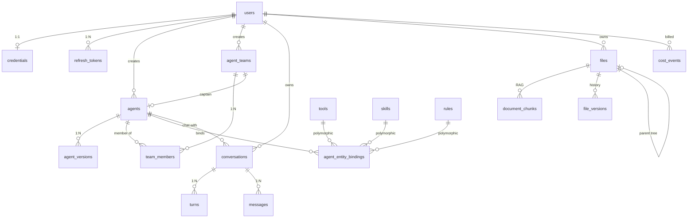

# 核心接口与数据模型定义

> **状态**：设计稿
> **创建时间**：2026-06-14
> **目的**：定义所有模块间的接口协议与核心数据类型，作为并行开发的契约

---

## 总览

本文档定义 AgentCore 的核心接口和数据模型。各模块依据这些接口独立开发，通过抽象协议耦合而非具体实现耦合。

### 模块依赖图

```
用户 ↔ [Electron 前端] ↔ [API 层 (FastAPI)] ↔ [编排器]
                                              ↔ [执行引擎] ↔ [Agent 运行时]
                                                           ↔ [工具系统]
                                                           ↔ [LLM Provider]
                                              ↔ [记忆系统]
                                              ↔ [存储层]
```

### 接口分类

| 类别 | 文档章节 | 说明 |
|------|---------|------|
| LLM 抽象层 | §一 | Agent 和编排器调用 LLM 的统一接口 |
| 工具系统 | §二 | Agent 调用工具的协议 |
| 沙箱执行 | §三 | 代码执行隔离 |
| API 层 | §四 | 前端↔后端 REST + SSE |
| 认证 API | §五 | 注册/登录/刷新/登出 Cookie 会话 |
| 数据库模型 | §六 | PostgreSQL 持久化 Schema |
| 前端状态 | §七 | Zustand Store 类型定义 |

> 编排器输入/输出、执行引擎内部数据结构、TaskWorkspace 已在各自文档中详细定义，本文不重复。交叉引用见各节末尾。

---

## 一、LLM Provider 抽象层

### 1.1 核心协议

```python
from typing import Protocol, AsyncIterator
from dataclasses import dataclass
from enum import Enum


class ModelTier(str, Enum):
    """编排器输出的模型偏好，运行时映射到具体模型。"""
    FAST = "fast"
    STANDARD = "standard"
    STRONG = "strong"


@dataclass
class LLMMessage:
    role: Literal["system", "user", "assistant", "tool"]
    content: str
    tool_calls: list["ToolCall"] | None = None
    tool_call_id: str | None = None          # role=tool 时的关联 ID
    reasoning_content: str | None = None     # DeepSeek 思考模式输出


@dataclass
class LLMRequest:
    messages: list[LLMMessage]
    model: str                                # 具体模型标识符
    temperature: float = 0.7
    max_tokens: int | None = None
    tools: list["ToolSchema"] | None = None   # 可用工具声明
    tool_choice: Literal["auto", "none", "required"] = "auto"
    stream: bool = True
    reasoning_effort: Literal["low", "medium", "high", "max"] | None = None


@dataclass
class LLMResponse:
    content: str
    reasoning_content: str | None = None
    tool_calls: list["ToolCall"] | None = None
    usage: "TokenUsage"
    finish_reason: Literal["stop", "tool_calls", "length", "content_filter"]
    model: str
    latency_ms: int


@dataclass
class LLMChunk:
    """流式输出的单个 chunk。"""
    delta_content: str | None = None
    delta_reasoning: str | None = None
    delta_tool_call: "ToolCallDelta" | None = None
    finish_reason: str | None = None
    usage: "TokenUsage | None" = None


@dataclass
class TokenUsage:
    input_tokens: int
    output_tokens: int
    reasoning_tokens: int = 0
    cache_hit_tokens: int = 0
    cache_miss_tokens: int = 0


class LLMProvider(Protocol):
    """LLM 调用的统一抽象。MVP 只实现 DeepSeekProvider。"""

    async def complete(self, request: LLMRequest) -> LLMResponse:
        """非流式调用。"""
        ...

    async def stream(self, request: LLMRequest) -> AsyncIterator[LLMChunk]:
        """流式调用，逐 chunk 返回。"""
        ...

    def resolve_model(self, tier: ModelTier) -> str:
        """将模型偏好映射到具体模型标识符。"""
        ...
```

### 1.2 模型映射配置

```python
@dataclass
class ModelMapping:
    """ModelTier → 具体模型的映射关系。可配置可覆盖。"""
    fast: str = "deepseek-v4-flash"
    standard: str = "deepseek-v4-flash"       # 思考模式 high
    strong: str = "deepseek-v4-pro"           # 思考模式 high


DEFAULT_MODEL_CONFIG = {
    "orchestrator": {
        "model": "deepseek-v4-flash",
        "reasoning_effort": None,             # 编排器用非思考模式
        "temperature": 0.3,
    },
    "agent_fast": {
        "model": "deepseek-v4-flash",
        "reasoning_effort": "high",
        "temperature": 0.7,
    },
    "agent_standard": {
        "model": "deepseek-v4-flash",
        "reasoning_effort": "high",
        "temperature": 0.7,
    },
    "agent_strong": {
        "model": "deepseek-v4-pro",
        "reasoning_effort": "high",
        "temperature": 0.7,
    },
}
```

### 1.3 与其他模块的关系

| 调用方 | 用途 | 典型配置 |
|--------|------|---------|
| 编排器 | 生成计划、检查点审视 | fast, non-reasoning, low temperature |
| Agent 运行时 | 执行任务步骤 | standard/strong, reasoning mode |
| 记忆系统 | 生成会话摘要、提取偏好 | fast, non-reasoning |
| 输出汇总器 | 合并多 Agent 结果 | standard |

---

## 二、工具系统

### 2.1 工具协议

```python
from typing import Protocol, Any


@dataclass
class ToolSchema:
    """工具的元信息声明，用于 LLM function calling。"""
    name: str
    description: str
    parameters: dict[str, Any]               # JSON Schema 格式
    category: Literal["filesystem", "search", "execution", "research"]
    approval: Literal["never", "grantable", "always"] = "never"  # 工具审批三态


@dataclass
class ToolCall:
    """LLM 发出的工具调用请求。"""
    id: str
    name: str
    arguments: dict[str, Any]


@dataclass
class ToolCallDelta:
    """流式场景下的工具调用增量。"""
    id: str
    name: str | None = None
    arguments_delta: str | None = None


@dataclass
class ToolResult:
    """工具执行结果。"""
    tool_call_id: str
    success: bool
    output: str                              # 结果文本（≤4000 字符，超出自动截断）
    error: str | None = None
    duration_ms: int
    metadata: dict[str, Any] | None = None   # 工具特有的附加信息


class Tool(Protocol):
    """工具实现的统一协议。"""

    @property
    def schema(self) -> ToolSchema:
        """返回工具元信息（名称、描述、参数 JSON Schema）。"""
        ...

    async def execute(self, arguments: dict[str, Any], context: "ToolContext") -> ToolResult:
        """执行工具调用。"""
        ...


@dataclass
class ToolContext:
    """工具执行时的上下文信息。"""
    execution_id: str
    step_id: str
    agent_id: str
    workspace_dir: Path                      # Agent 的工作目录
    user_id: str
```

### 2.2 MVP 内置工具

| 工具名 | 分类 | 参数 | 说明 |
|--------|------|------|------|
| `web_search` | research | query: str, max_results: int | 网络搜索 |
| `file_read` | filesystem | path: str | 读取文件 |
| `file_write` | filesystem | path: str, content: str | 写入文件 |
| `file_list` | filesystem | directory: str, pattern: str | 列出文件 |
| `code_execute` | execution | code: str, language: str, timeout_s: int | 沙箱执行代码 |

### 2.3 工具注册表

```python
class ToolRegistry:
    """管理所有可用工具的注册和查询。"""

    def register(self, tool: Tool) -> None: ...
    def get(self, name: str) -> Tool | None: ...
    def list_all(self) -> list[ToolSchema]: ...
    def list_by_category(self, category: str) -> list[ToolSchema]: ...
    def get_schemas_for_agent(self, tool_names: list[str]) -> list[ToolSchema]:
        """根据编排器分配的工具名列表，返回对应的 ToolSchema（供 LLM function calling）。"""
        ...
```

---

## 三、沙箱执行（SandboxProvider）

### 3.1 协议定义

```python
@dataclass
class ExecutionRequest:
    code: str
    language: Literal["python", "javascript", "bash"]
    timeout_seconds: int = 30
    memory_limit_mb: int = 256
    stdin: str | None = None


@dataclass
class ExecutionResult:
    success: bool
    stdout: str
    stderr: str
    exit_code: int
    duration_ms: int
    truncated: bool = False                  # 输出是否被截断


class SandboxProvider(Protocol):
    """代码执行沙箱的统一抽象。MVP 用 SubprocessSandbox。"""

    async def execute(self, request: ExecutionRequest) -> ExecutionResult:
        """在隔离环境中执行代码。"""
        ...

    async def health_check(self) -> bool:
        """检查沙箱是否可用。"""
        ...
```

### 3.2 MVP 实现：SubprocessSandbox

```python
class SubprocessSandbox:
    """受限 subprocess 沙箱。"""

    async def execute(self, request: ExecutionRequest) -> ExecutionResult:
        # 1. 创建临时目录
        # 2. 写入代码文件
        # 3. subprocess.Popen + timeout + resource limits
        # 4. 捕获 stdout/stderr
        # 5. 清理临时目录
        ...
```

安全措施：
- `resource.setrlimit` 限制 CPU 时间和内存
- 临时目录隔离（每次执行独立 tmpdir）
- 执行完立即清理
- 禁止 import 危险模块（通过 seccomp 或 import hook）
- 网络出站阻断（iptables 规则）

---

## 四、API 层（前端 ↔ 后端）

### 4.1 REST API

#### 对话管理

```
POST   /v1/conversations                → 创建新对话
GET    /v1/conversations                → 获取对话列表
GET    /v1/conversations/{id}           → 获取单个对话详情
DELETE /v1/conversations/{id}           → 删除对话
PATCH  /v1/conversations/{id}           → 更新对话标题等元数据
```

#### 消息与执行

```
POST   /v1/conversations/{id}/messages  → 发送用户消息（触发编排+执行）
GET    /v1/conversations/{id}/messages  → 获取历史消息列表
POST   /v1/conversations/{id}/stop      → 停止当前执行
```

#### 检查点交互

```
POST   /api/executions/{id}/checkpoints/{cp_id}/resolve
       body: { action: "approve" | "adjust" | "stop", feedback?: string }
```

#### 系统

```
GET    /api/health                  → 健康检查
GET    /api/tools                   → 获取可用工具列表
```

### 4.2 SSE 实时流

```
GET /v1/conversations/{id}/stream       → SSE 连接，推送执行事件
```

事件类型详见 [执行引擎架构设计.md §十二](执行引擎架构设计.md)。

### 4.3 核心请求/响应模型

```python
# --- 会话 ---

class SessionCreate(BaseModel):
    title: str | None = None

class SessionResponse(BaseModel):
    id: str
    title: str
    created_at: datetime
    updated_at: datetime
    message_count: int
    last_message_preview: str | None

class SessionListResponse(BaseModel):
    sessions: list[SessionResponse]
    total: int


# --- 消息 ---

class MessageSend(BaseModel):
    content: str
    attachments: list[str] | None = None     # 文件路径（Day 2）

class MessageResponse(BaseModel):
    id: str
    role: Literal["user", "assistant"]
    content: str
    created_at: datetime
    execution_id: str | None                 # 关联的执行 ID（assistant 消息）
    agent_outputs: list["AgentOutputBrief"] | None

class AgentOutputBrief(BaseModel):
    agent_id: str
    role: str
    step_id: str
    summary: str
    status: str


# --- 检查点 ---

class CheckpointResolve(BaseModel):
    action: Literal["approve", "adjust", "stop"]
    feedback: str | None = None
```

### 4.4 SSE 事件 TypeScript 类型（前端消费）

```typescript
// 由后端 dataclass 自动生成（openapi-typescript）

interface SSEEvent {
  type: string;
  execution_id: string;
  timestamp: string;
  payload: Record<string, unknown>;
}

interface ExecutionStartedPayload {
  plan_type: "single_agent" | "multi_agent";
  task_summary: string;
  agents: AgentInfo[];
  steps: StepInfo[];
}

interface StepOutputChunkPayload {
  step_id: string;
  agent_id: string;
  chunk: string;
}

interface CheckpointTriggeredPayload {
  checkpoint_id: string;
  after_step: string;
  summary: string;
  reason: string;
  actions: ("approve" | "adjust" | "stop")[];
}

interface ExecutionCompletedPayload {
  final_result: string;
  total_duration_ms: number;
  agents_used: number;
  steps_completed: number;
}
```

---

## 五、认证 API 契约

基于技术架构 §九 的双令牌 httpOnly Cookie 模型。

### 5.1 端点清单

#### POST /v1/auth/register

注册新用户。

**请求体**：

```json
{
  "email": "user@example.com",
  "password": "string (min 8 chars)",
  "name": "string (optional)"
}
```

**成功响应** (201)：

- Set-Cookie: access_token (httpOnly, 30min)
- Set-Cookie: refresh_token (httpOnly, 7d)

```json
{
  "user": {
    "id": "uuid",
    "email": "user@example.com",
    "name": "string",
    "created_at": "ISO 8601"
  }
}
```

**错误**：

- 409: 邮箱已注册
- 422: 参数验证失败

#### POST /v1/auth/login

用户登录。

**请求体**：

```json
{
  "email": "user@example.com",
  "password": "string",
  "remember_me": false
}
```

**成功响应** (200)：

- Set-Cookie: access_token (httpOnly, 30min)
- Set-Cookie: refresh_token (httpOnly, 7d / remember_me=true 时 30d)

```json
{
  "user": {
    "id": "uuid",
    "email": "user@example.com",
    "name": "string"
  }
}
```

**错误**：

- 401: 邮箱或密码错误
- 429: 登录尝试过多

#### POST /v1/auth/refresh

静默刷新访问令牌。前端 401 拦截器自动调用。

**请求**：无请求体，依赖 Cookie 中的 refresh_token

**成功响应** (200)：

- Set-Cookie: access_token (新令牌)
- Set-Cookie: refresh_token (轮换后的新令牌)

```json
{ "ok": true }
```

**错误**：

- 401: refresh_token 无效/过期/已吊销 → 前端跳转登录页

**并发安全**：10s 宽限窗口内允许同一旧令牌多次交换（多标签页场景），窗口外判为泄露并吊销整族。

#### POST /v1/auth/logout

登出。吊销当前 refresh_token family。

**请求**：无请求体

**成功响应** (200)：

- Clear-Cookie: access_token
- Clear-Cookie: refresh_token

```json
{ "ok": true }
```

#### GET /v1/auth/me

获取当前用户信息。需要有效的 access_token。

**成功响应** (200)：

```json
{
  "user": {
    "id": "uuid",
    "email": "user@example.com",
    "name": "string",
    "created_at": "ISO 8601",
    "preferences": {
      "language": "zh-CN",
      "theme": "system"
    }
  }
}
```

**错误**：

- 401: 未认证 → 触发静默刷新

### 5.2 DB 模型

```sql
CREATE TABLE users (
    id UUID PRIMARY KEY DEFAULT gen_random_uuid(),
    email VARCHAR(255) UNIQUE NOT NULL,
    password_hash VARCHAR(255) NOT NULL,
    name VARCHAR(100),
    preferences JSONB DEFAULT '{}',
    created_at TIMESTAMPTZ DEFAULT now(),
    updated_at TIMESTAMPTZ DEFAULT now()
);

CREATE TABLE refresh_tokens (
    id UUID PRIMARY KEY DEFAULT gen_random_uuid(),
    user_id UUID NOT NULL REFERENCES users(id),
    token_hash VARCHAR(255) NOT NULL,
    family_id UUID NOT NULL,
    rotated_at TIMESTAMPTZ,
    expires_at TIMESTAMPTZ NOT NULL,
    created_at TIMESTAMPTZ DEFAULT now()
);

CREATE INDEX idx_refresh_tokens_hash ON refresh_tokens(token_hash);
CREATE INDEX idx_refresh_tokens_family ON refresh_tokens(family_id);
```

### 5.3 Pydantic 模型

```python
class RegisterRequest(BaseModel):
    email: EmailStr
    password: str = Field(min_length=8)
    name: str | None = None

class LoginRequest(BaseModel):
    email: EmailStr
    password: str
    remember_me: bool = False

class UserResponse(BaseModel):
    id: UUID
    email: str
    name: str | None
    created_at: datetime
    preferences: dict = {}

class AuthResponse(BaseModel):
    user: UserResponse
```

### 5.4 Cookie 配置约束

| 属性 | access_token | refresh_token |
|------|-------------|--------------|
| httpOnly | ✅ | ✅ |
| secure | ✅ (生产) | ✅ (生产) |
| sameSite | Lax | Lax |
| path | / | / (必须是 /，详见技术架构 §9.4) |
| maxAge | 30min | 7d / 30d |

> ⚠️ refresh_token 的 path **必须**设为 `/`。设为后端路由路径会导致 Cookie 在反向代理场景下不回传，生产环境 100% 静默刷新失败。详见技术架构 §9.4。

---

## 六、数据库模型（PostgreSQL）

### 6.1 核心表

```sql
-- 用户
CREATE TABLE users (
    id UUID PRIMARY KEY DEFAULT gen_random_uuid(),
    email VARCHAR(255) UNIQUE,
    name VARCHAR(100),
    created_at TIMESTAMPTZ DEFAULT now(),
    updated_at TIMESTAMPTZ DEFAULT now()
);

-- 对话
CREATE TABLE conversations (
    id UUID PRIMARY KEY DEFAULT gen_random_uuid(),
    user_id UUID REFERENCES users(id) ON DELETE CASCADE,
    title VARCHAR(500),
    summary TEXT,                              -- 对话结束时 LLM 生成的摘要
    key_decisions JSONB DEFAULT '[]',          -- 关键决策列表
    message_count INT DEFAULT 0,
    created_at TIMESTAMPTZ DEFAULT now(),
    updated_at TIMESTAMPTZ DEFAULT now()
);

-- 消息
CREATE TABLE messages (
    id UUID PRIMARY KEY DEFAULT gen_random_uuid(),
    conversation_id UUID REFERENCES conversations(id) ON DELETE CASCADE,
    role VARCHAR(20) NOT NULL,                -- user | assistant
    content TEXT NOT NULL,
    execution_id UUID,                        -- assistant 消息关联的执行
    metadata JSONB DEFAULT '{}',
    created_at TIMESTAMPTZ DEFAULT now()
);
CREATE INDEX idx_messages_conversation ON messages(conversation_id, created_at);

-- 执行记录
CREATE TABLE executions (
    id UUID PRIMARY KEY DEFAULT gen_random_uuid(),
    conversation_id UUID REFERENCES conversations(id) ON DELETE CASCADE,
    plan JSONB NOT NULL,                      -- 编排器输出的完整计划
    status VARCHAR(20) NOT NULL,              -- planning | running | paused | completed | failed
    workspace_snapshot JSONB,                 -- TaskWorkspace 归档
    metrics JSONB DEFAULT '{}',
    started_at TIMESTAMPTZ DEFAULT now(),
    completed_at TIMESTAMPTZ
);

-- 用户记忆
CREATE TABLE user_memory (
    user_id UUID PRIMARY KEY REFERENCES users(id) ON DELETE CASCADE,
    preferences JSONB DEFAULT '{}',
    facts JSONB DEFAULT '[]',
    updated_at TIMESTAMPTZ DEFAULT now()
);
```

### 6.2 数据模型架构约定 ✅ 已确定

> 从实践中沉淀的数据建模原则，指导新系统的 schema 设计。

#### 主键与引用

- 主键统一 UUID（Python `str(uuid4())`）
- **不使用 SQLAlchemy ForeignKey**，引用关系通过 `*_id` 字段在应用层维护——简化迁移、避免级联锁、允许跨模块松耦合

#### 软删除架构

带 `deleted_at` 字段的表采用查询层默认过滤：ORM `select` 默认自动过滤 `deleted_at IS NULL`，需查已删除数据须显式 opt-out。选择「全局 event + 按实体白名单分批」而非：
- 全局绑基类（一次反转所有表，波及大量故意不过滤的查询）
- 纯人工纪律（漏一处即静默泄露已删数据）

#### 版本体系

- Agent 用独立 `agent_versions` 表维护版本链
- 文件用 `file_versions` 表
- Team 不做版本化（自相矛盾，已弃）

#### 文件模型单表设计

文件系统采用单表 + 维度收敛设计（`kind` × `role`），不拆多张领域表——单表是「文件夹 = 上下文边界、一棵树什么都能放」的物理基础。拆表会打碎统一内容树。

| 维度 | 含义 |
|------|------|
| `kind` | 节点类型（folder / document / upload / base），DB CheckConstraint |
| `role` | AI 上下文角色（instruction / preference / attachment 等） |

非树资产（头像等）剥离到独立 asset 模块（不在树、无 parent_id 语义）。

#### JSONB 策略

JSONB 列不盲加 GIN 索引。真正的扩展杠杆是「先用高选择性主键/外键列限定作用域 + 应用层分页」。复查触发条件：单作用域记录到万级、出现跨作用域 JSONB 查询、或特定操作符成为高频慢查询。

#### ORM 是 Schema 真相源

全部表由单一 squash baseline（alembic autogenerate）建立，`alembic check` 保证 ORM 与迁移零漂移。冷启动 = migrate（建 schema）+ seed（灌初始数据），职责分离。默认值一律用 `server_default`（数据库级）。

### 6.3 实体关系图



### 6.4 模块-表映射

| 模块 | 核心表 | 关系要点 |
|------|--------|----------|
| user | users, credentials, refresh_tokens | 1:1 凭证；BYOK 单 key |
| agent | agents, agent_versions, agent_teams, team_members | 版本链；Team 成员；Fork 自引用 |
| conversation | conversations, messages, turns | Conversation → Turn → Message |
| capability | tools, skills, rules, agent_entity_bindings | `entity_type`+`entity_id` 多态绑定 |
| file | files, document_chunks, file_versions | 树形 parent_id；`role` 驱动上下文注入 |
| billing | cost_events, user_quotas | append-only 记账；按用户配额覆盖 |
| runtime | approvals, turn_entries | 审批持久化；Turn Journal 事实流 |

### 6.5 运行时状态（Redis）

| Key 模式 | 用途 |
|---|---|
| `checkpoint:{conversation_id}` | ReAct 循环最新快照 |
| `{kind}:pending:{conv}[:{key}]` | 交互等待标记（统一原语） |
| `{kind}:resp:{conv}[:{key}]` | 交互结果队列（BLPOP） |
| `approval:turn_grant:{conv_id}` | 本轮内已授权工具集合 |

Turn Journal（`turn_entries` 表）为每 turn 的 append-only 事实流，主键 `(turn_id, seq)`，九类事实。回合内一切事实只写这里，messages/turns/SSE/快照/历史回放皆其投影。

### 6.6 索引策略

```sql
CREATE INDEX idx_conversations_user ON conversations(user_id, updated_at DESC);
CREATE INDEX idx_executions_conversation ON executions(conversation_id, started_at DESC);
```

### 6.7 Pydantic ORM 模型

```python
from pydantic import BaseModel
from datetime import datetime


class UserDB(BaseModel):
    id: str
    email: str | None
    name: str | None
    created_at: datetime


class SessionDB(BaseModel):
    id: str
    user_id: str
    title: str | None
    summary: str | None
    key_decisions: list[str]
    message_count: int
    created_at: datetime
    updated_at: datetime


class MessageDB(BaseModel):
    id: str
    conversation_id: str
    role: Literal["user", "assistant"]
    content: str
    execution_id: str | None
    metadata: dict
    created_at: datetime


class ExecutionDB(BaseModel):
    id: str
    conversation_id: str
    plan: dict                               # OrchestratorPlan JSON
    status: str
    workspace_snapshot: dict | None
    metrics: dict
    started_at: datetime
    completed_at: datetime | None
```

---

## 七、前端状态类型（Zustand Store）

### 7.1 Store 划分

| Store | 职责 | 持久化 |
|-------|------|--------|
| `useSessionStore` | 会话列表、当前会话、消息 | LocalStorage (列表) + API |
| `useExecutionStore` | 当前执行状态、Agent 状态、步骤进度 | 不持久化（运行时） |
| `useGraphStore` | 图视图节点/边/布局 | 不持久化 |
| `useUIStore` | 视图模式、侧边栏状态、主题 | LocalStorage |

### 7.2 核心类型

```typescript
// --- Session Store ---

interface Session {
  id: string;
  title: string;
  updatedAt: string;
  messageCount: number;
  lastMessagePreview: string | null;
}

interface Message {
  id: string;
  role: "user" | "assistant";
  content: string;
  createdAt: string;
  executionId: string | null;
  isStreaming: boolean;
}

interface SessionState {
  sessions: Session[];
  currentSessionId: string | null;
  messages: Message[];

  createSession: () => Promise<string>;
  sendMessage: (content: string) => Promise<void>;
  stopGeneration: () => void;
  loadSessions: () => Promise<void>;
  loadMessages: (conversationId: string) => Promise<void>;
}


// --- Execution Store ---

type StepStatus = "pending" | "ready" | "running" | "completed" | "failed" | "cancelled";
type ExecutionStatus = "planning" | "running" | "paused" | "completed" | "failed";

interface AgentState {
  id: string;
  role: string;
  status: "idle" | "working" | "completed" | "error";
  currentStepId: string | null;
  outputChunks: string[];                    // 流式累积
}

interface StepState {
  id: string;
  agentId: string;
  task: string;
  status: StepStatus;
  dependsOn: string[];
  outputSummary: string | null;
  durationMs: number | null;
}

interface CheckpointState {
  id: string;
  afterStep: string;
  reason: string;
  status: "pending" | "resolved";
  actions: ("approve" | "adjust" | "stop")[];
}

interface ExecutionState {
  currentExecution: {
    id: string;
    planType: "single_agent" | "multi_agent";
    taskSummary: string;
    status: ExecutionStatus;
    agents: AgentState[];
    steps: StepState[];
    checkpoints: CheckpointState[];
    progress: { completed: number; total: number };
  } | null;

  handleSSEEvent: (event: SSEEvent) => void;
  resolveCheckpoint: (checkpointId: string, action: string, feedback?: string) => Promise<void>;
}


// --- Graph Store ---

interface GraphNode {
  id: string;
  type: "agent";
  data: {
    agentId: string;
    role: string;
    stepId: string;
    status: StepStatus;
    isAnimating: boolean;                    // 是否播放发光/脉冲动画
  };
  position: { x: number; y: number };
}

interface GraphEdge {
  id: string;
  source: string;
  target: string;
  animated: boolean;
}

interface GraphState {
  nodes: GraphNode[];
  edges: GraphEdge[];
  selectedNodeId: string | null;

  buildFromExecution: (execution: ExecutionState["currentExecution"]) => void;
  updateNodeStatus: (stepId: string, status: StepStatus) => void;
  selectNode: (nodeId: string | null) => void;
}


// --- UI Store ---

type ViewMode = "chat" | "graph";

interface UIState {
  viewMode: ViewMode;
  sidebarOpen: boolean;
  theme: "light" | "dark" | "system";

  setViewMode: (mode: ViewMode) => void;
  toggleSidebar: () => void;
  setTheme: (theme: UIState["theme"]) => void;
}
```

---

## 八、模块间接口依赖总结

```
┌─────────────┐     LLMProvider      ┌─────────────┐
│  编排器      │ ──────────────────→ │ LLM 抽象层   │
│  Orchestrator│                      │ (DeepSeek)  │
└──────┬──────┘                      └─────────────┘
       │ OrchestratorPlan (JSON)              ↑
       ▼                                     │ LLMProvider
┌─────────────┐     Tool Protocol    ┌──────┴──────┐
│  执行引擎    │ ──────────────────→ │  Agent 运行时│
│  Scheduler  │                      │  (协程)     │
└──────┬──────┘                      └──────┬──────┘
       │ SSE Events                          │ Tool.execute()
       ▼                                     ▼
┌─────────────┐                      ┌─────────────┐
│  API 层     │                      │  工具系统    │
│  (FastAPI)  │                      │  ToolRegistry│
└──────┬──────┘                      └──────┬──────┘
       │ REST + SSE                          │ SandboxProvider
       ▼                                     ▼
┌─────────────┐                      ┌─────────────┐
│  前端       │                      │  沙箱       │
│  (Electron) │                      │  (subprocess)│
└─────────────┘                      └─────────────┘
```

### 接口契约原则

1. **类型是真相源**：后端 Pydantic model / dataclass 是唯一类型来源，前端类型由 OpenAPI 生成
2. **Protocol 优于继承**：所有抽象用 `Protocol`（结构子类型），不用 ABC
3. **数据不可变**：跨模块传递的数据对象应视为不可变，修改需创建新实例
4. **错误用异常**：模块内部用异常传递错误，API 边界转为 HTTP 状态码 + JSON body

---

## 九、交叉引用

| 接口/数据结构 | 定义位置 |
|--------------|---------|
| OrchestratorInput / OrchestratorPlan | [编排器Prompt与输出结构.md §一~§二](编排器Prompt与输出结构.md) |
| TaskGraph / TaskNode / StepStatus | [执行引擎架构设计.md §二](执行引擎架构设计.md) |
| AgentInstance / AgentMetrics | [执行引擎架构设计.md §四](执行引擎架构设计.md) |
| TaskWorkspace / StepOutput / Artifact | [执行引擎架构设计.md §十一](执行引擎架构设计.md) |
| SSE 事件协议 | [执行引擎架构设计.md §十二](执行引擎架构设计.md) |
| SessionSummary / UserMemory | [Agent记忆与知识系统.md §一](Agent记忆与知识系统.md) |
| 检查点审视输入/输出 | [编排器Prompt与输出结构.md §五](编排器Prompt与输出结构.md) |

---

## 变更日志

| 日期 | 变更 |
|------|------|
| 2026-06-14 | 新增 §五：认证 API 契约（双令牌 Cookie、端点、DB/Pydantic 模型、Cookie 约束） |
| 2026-06-14 | 新增 §6.2~6.5：数据模型架构约定、ER 图、模块-表映射、Redis 运行时状态 |
| 2026-06-14 | 初稿：LLMProvider、工具协议、沙箱接口、REST API、数据库模型、前端状态类型 |
